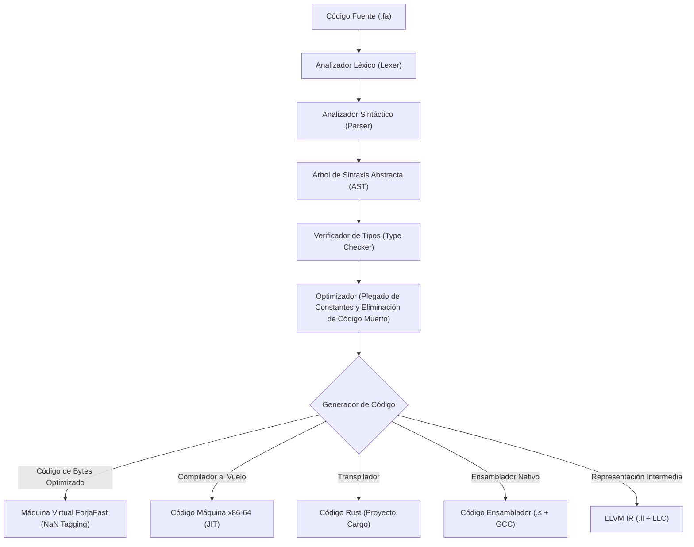

# 🔥 Forja (fa)

<div align="center">

[](https://github.com/forja-lang/forja/releases)
[]()
[]()
[](examples/)
[](https://codespaces.new/forja-lang/forja)

</div>

Forja es un lenguaje de programación educativo moderno con sintaxis y palabras clave completamente en español. Está diseñado para enseñar conceptos de sistemas, teoría de lenguajes de programación y diseño por contrato sin la complejidad sintáctica de Rust. Incluye un compilador nativo, un compilador al vuelo (JIT) para arquitecturas x86-64, múltiples máquinas virtuales y soporte de interfaces gráficas.

📖 **[Leé la documentación oficial aquí](https://forja-lang.github.io/docs)**

---

## ⚙️ Arquitectura del Compilador e Intérprete

El siguiente diagrama detalla cómo se procesa el código fuente de Forja hasta sus distintos entornos de ejecución:



---

## 📚 Sintaxis del Lenguaje por Ejemplo

### 1. Variables, Constantes y Tipos Básicos
```forja
// Las variables son mutables por defecto usando 'variable' o 'var'
variable edad = 18
edad = 19 // ✅ Permitido

// Las constantes son inmutables usando 'constante' o 'const'
constante pi = 3.14159
// pi = 3.2 // ❌ Error en tiempo de compilación
```

### 2. Control de Flujo (Condicionales y Bucles)
```forja
// Condicional clásico
si (edad >= 18) {
    escribir("Sos mayor de edad")
} sino {
    escribir("Sos menor de edad")
}

// Bucle condicional
variable contador = 0
mientras (contador < 3) {
    escribir("Contador: " + contador)
    contador = contador + 1
}

// Bucle determinado
para (variable i = 0; i < 5; i = i + 1) {
    escribir("Iteración: " + i)
}
```

### 3. Interpolación de Cadenas
Forja soporta interpolación directa con `{expresion}` y también con `${expresion}`:
```forja
variable nombre = "Mundo"
variable edad = 25

// Interpolación con llaves simples
escribir("Hola {nombre}, tenés {edad} años")

// Interpolación con dólar-llave (también soportado)
escribir("Resultado: ${2 + 3}")

// Escape de llaves literales
escribir("JSON: \{\"clave\": \"valor\"\}")
```

### 4. Acceso a Mapas con Sintaxis de Punto
```forja
variable config = {"host": "localhost", "puerto": 8080}

// Acceso con punto (equivale a config["host"])
escribir(config.host)    // → "localhost"
escribir(config.puerto)  // → 8080
```

### 5. Métodos Integrados en Tipos Primitivos
```forja
// Métodos de Texto
variable txt = "hola mundo"
escribir(txt.longitud())       // → 10
escribir(txt.a_mayusculas())   // → "HOLA MUNDO"
escribir(txt.a_minusculas())   // → "hola mundo"
escribir(txt.contiene("mundo"))// → verdadero

// Métodos de Arreglo
variable nums = [1, 2, 3]
nums.empujar(4)
escribir(nums.longitud())      // → 4
```

### 6. Inicialización Struct-Literal
```forja
clase Persona {
    nombre
    edad
}

// Inicialización con llaves (sin constructor manual)
variable p = nuevo Persona { nombre: "Ana", edad: 25 }
escribir(p.nombre) // → "Ana"

// También funciona la forma clásica con constructor
variable q = nuevo Persona("Juan", 30)
```

### 7. Operador Ternario
```forja
variable edad = 20
variable mensaje = edad >= 18 ? "Mayor" : "Menor"
escribir(mensaje) // → "Mayor"
```

### 8. Funciones y Diseño por Contrato (Design by Contract)
Forja implementa el paradigma de diseño por contrato directamente en la firma de las funciones:
```forja
funcion dividir(a: Entero, b: Entero) -> Entero
    requiere b != 0, "No se puede dividir por cero (Precondición)"
    asegura resultado <= a, "El resultado es menor o igual al dividendo (Postcondición)"
{
    retornar a / b
}
```

---

## 💻 Consola de Comandos (CLI)

Todos los comandos de la herramienta de consola de Forja aceptan términos y argumentos en español.

### Detección y Configuración Inicial

Para utilizar la herramienta de consola en cualquier directorio, podés configurar un alias o compilar el binario directamente en la carpeta del compilador:

```powershell
# Compilar todas las herramientas en modo optimizado (compilador, depurador, interfaz gráfica y servidor de lenguaje)
PS C:\forja> cargo build --release --features all
```

---

### Referencia de Comandos en Español

| Comando en Consola | Comando Alternativo | Propósito |
| :--- | :--- | :--- |
| **`ejecutar <archivo.fa>`** | `correr` | Compila y ejecuta el script en la máquina virtual *ForjaFast* (por defecto). |
| **`compilar <archivo.fa>`** | `construir` | Genera un archivo ejecutable autónomo (`.exe`) optimizado de **~350 KB**. |
| **`interactivo`** | `repl` | Inicia la consola de lectura e interpretación línea por línea. |
| **`probar [archivo.fa]`** | `test` | Corre los módulos de prueba unitaria marcados con `@test`. |
| **`medir <archivo.fa>`** | `benchmark` | Analiza el rendimiento del código (mediciones en frío y en caliente). |
| **`diagrama <archivo.fa>`** | `grafico` | Genera un diagrama en formato Mermaid (.mmd) con la representación del AST. |
| **`formatear <archivo.fa>`** | `fmt` | Aplica una indentación estándar de 4 espacios al código fuente. |
| **`compilar-asm <archivo.fa>`**| `asm` | Genera código de ensamblador nativo para Windows o Linux. |
| **`transpilar <archivo.fa>`** | `transpilador` | Traduce el código de Forja a un proyecto estructurado en Rust. |
| **`documentar <archivo.fa>`** | `doc` | Lee comentarios documentales (`///`) y exporta páginas de ayuda HTML. |
| **`colorear <archivo.fa>`** | `highlight` | Imprime el código fuente con colores ANSI en la terminal. |
| **`nuevo <nombre>`** | `crear` | Crea un nuevo proyecto con estructura estándar y archivos de configuración. |
| **`iniciar`** | `init` | Inicializa un proyecto de Forja en el directorio actual. |
| **`aprender`** | `learn` | Ejecuta el curso y tutorial interactivo del lenguaje. |
| **`explicar <concepto>`** | `explain` | Busca y describe la sintaxis o palabras clave en el glosario. |
| **`palabras`** | `keywords` | Muestra la lista completa de palabras reservadas del lenguaje. |
| **`ayuda`** | `help` | Imprime el manual general de la consola de comandos. |

---

### Ejemplos Prácticos de Consola

Aquí se ilustra cómo interactuar con el compilador en un entorno de comandos típico:

#### 1. Ejecutar un Script en la Máquina Virtual
```powershell
# Ejecución estándar (usa la máquina virtual optimizada ForjaFast por defecto)
PS C:\forja> forja ejecutar ejemplos/01_hola.fa

# Seleccionar la máquina virtual original
PS C:\forja> forja ejecutar ejemplos/01_hola.fa --vm vm

# Seleccionar el compilador al vuelo (JIT) nativo
PS C:\forja> forja ejecutar ejemplos/01_hola.fa --vm jit
```

#### 2. Compilar a un Ejecutable Autónomo Ligero (~350 KB)
```powershell
# Compilar script de consola
PS C:\forja> forja compilar ejemplos/05_condicionales.fa -o condicionales.exe
✅ Ejecutable generado: condicionales.exe (277 bytes de código de bytes)

# Ejecutar de forma directa e instantánea sin dependencias
PS C:\forja> .\condicionales.exe
Sos mayor de edad
Buen trabajo!
```

#### 3. Realizar una Medición de Rendimiento (Benchmark)
```powershell
# Comparar el script corriendo en todas las configuraciones de máquinas virtuales
PS C:\forja> forja medir ejemplos/40_fibonacci.fa --vm todas --iters 100
```

#### 4. Modo Interactivo (Consola de Lectura y Ejecución Directa)
```powershell
PS C:\forja> forja interactivo
🔨 Forja v0.8.8 — Escribí 'salir' para terminar
> variable x = 10
> x = x + 5
> escribir(x)
15
> salir
👋 ¡Hasta luego!
```

---

## ⚡ Motores de Ejecución y Rendimiento

Forja incluye múltiples opciones de interpretación y generación de código:

| Motor | Tipo de Ejecución | Rendimiento Relativo |
| :--- | :--- | :--- |
| **Representación LLVM** | Compilación estática a través de LLC (`-O2`) | **500x** (Velocidad nativa óptima) |
| **Ensamblador Nativo** | Generación de código ensamblador más GCC (`-O2`) | **437x** (Velocidad nativa directa) |
| **Compilador al Vuelo (JIT)** | Traducción dinámica a código máquina x86-64 | **62x** (Ejecución híbrida rápida) |
| **Máquina Virtual ForjaFast** | Intérprete optimizado con *NaN Tagging* de 8 bytes | **4.8x** (Ejecución por defecto) |
| **Máquina Virtual Original** | Intérprete estándar basado en pila e instrucciones | **1x** (Línea de base) |

---

## 🎨 Desarrollo Gráfico (GUI)

Forja permite crear complejas aplicaciones de escritorio reactivas e interactivas gracias a la librería de interfaces gráficas. Las interfaces siguen la guía de estilo de **Material Design 3 (Material You)**, con soporte automático para modo oscuro y claro según el sistema operativo.

```powershell
# Ejecutar un script que importa "gui" en modo nativo
PS C:\forja> forja ejecutar ejemplos/gui.fa --native

# Forzar tema oscuro con un color semilla específico
PS C:\forja> forja ejecutar ejemplos/gui.fa --native --dark --tema #FF5722
```

---

## ⚙️ Compilación Cruzada para Android

El compilador soporta la generación directa de binarios optimizados para dispositivos Android (arquitecturas ARM64, x86_64, ARM32 y x86):

```bash
# Compilar para todos los dispositivos soportados
$ bash scripts/build-android.sh

# Compilar únicamente para arquitectura ARM64 de 64 bits
$ bash scripts/build-android.sh aarch64-linux-android
```

---

## 📜 Licencia y Uso de Marca

*   **Compilador y Herramientas**: Licenciado bajo la **Licencia Pública General de GNU v3.0 (GPLv3)**.
*   **Tus Programas**: Escribir software en Forja no restringe su distribución. **Tus aplicaciones son de tu propiedad exclusiva** y podés elegir la licencia comercial o de código abierto que prefieras.