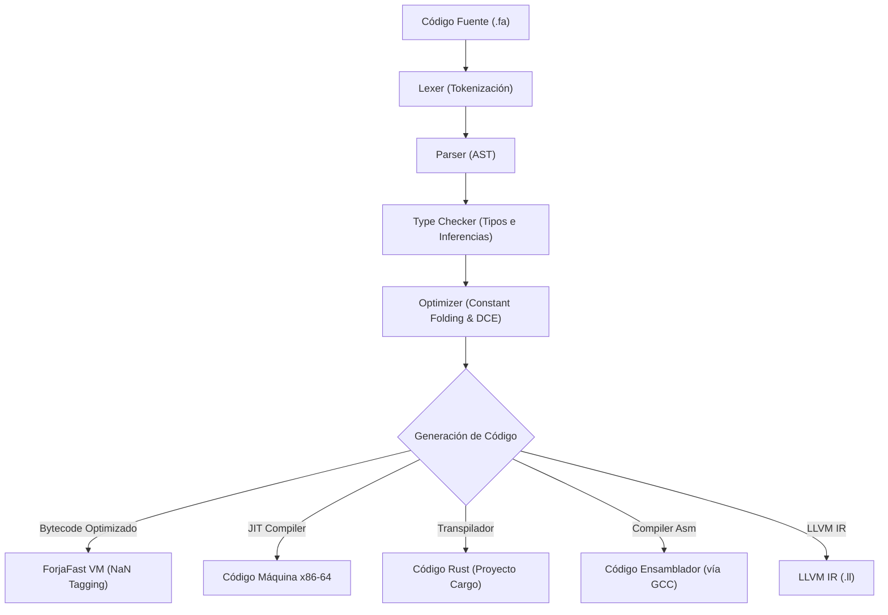

# 🔥 Forja (fa)

Forja es un lenguaje de programación educativo con palabras clave en español, diseñado para enseñar conceptos de sistemas y diseño por contrato sin la complejidad sintáctica de Rust. El lenguaje incluye un compilador AOT, JIT nativo x86-64, múltiples implementaciones de VM (incluyendo la ultra-rápida *ForjaFast*) y targets de compilación a ensamblador y LLVM IR.

---

## 🎨 Características Destacadas

*   **Palabras Clave en Español**: Ideal para la educación y el aprendizaje natural en hispanohablantes.
*   **Design by Contract**: Soporte nativo para precondiciones, postcondiciones e invariantes (`requiere`, `asegura`, `siempre`).
*   **Doble VM y JIT**: Elige entre la VM estándar, la VM optimizada *ForjaFast* (con NaN Tagging y fusión de opcodes) o JIT x86-64 nativo.
*   **UI Reactiva**: Librería nativa de interfaz gráfica con diseño inspirado en Material Design 3 (Material You).
*   **Multi-Plataforma**: Compilación AOT cruzada a ejecutables autónomos ligeros (~350 KB), incluyendo soporte para Windows, Linux, macOS y Android.

---

## ⚙️ Arquitectura del Compilador

El siguiente diagrama ilustra el flujo del pipeline del compilador desde el código fuente hasta sus múltiples destinos de ejecución:



---

## 🛠️ Comandos de la CLI (en Español)

La interfaz de comandos de Forja está completamente localizada al español. Podés ejecutar las herramientas usando `forja <comando>` o en desarrollo mediante `cargo run --release --bin forja -- <comando>`.

| Comando en Español | Equivalente en Inglés | Descripción |
| :--- | :--- | :--- |
| **`ejecutar <archivo.fa>`** | `run` | Compila y corre un archivo en la VM ForjaFast por defecto. |
| **`compilar <archivo.fa>`** | `build` | Genera un ejecutable autónomo (`.exe`) ultraligero (~350 KB). |
| **`interactivo`** | `repl` | Inicia la consola REPL con persistencia de estado. |
| **`probar [archivo.fa]`** | `test` | Corre unit-tests marcados con el atributo `@test`. |
| **`medir <archivo.fa>`** | `bench` | Realiza benchmarks de tiempo de ejecución (Cold y Hot). |
| **`diagrama <archivo.fa>`** | `diagram` | Exporta una visualización HTML interactiva del AST. |
| **`formatear <archivo.fa>`** | `fmt` | Da formato consistente de 4 espacios al código fuente. |
| **`compilar-asm <archivo.fa>`** | `build-asm` | Compila a código ensamblador nativo (x86-64 o ARM64). |
| **`transpilar <archivo.fa>`** | `transpile` | Convierte el script Forja en un proyecto Rust completo. |
| **`documentar <archivo.fa>`** | `doc` | Genera documentación HTML a partir de triple-slash (`///`) comments. |
| **`colorear <archivo.fa>`** | `highlight` | Muestra el código fuente con resaltado ANSI en la terminal. |
| **`nuevo <nombre>`** | `new` | Crea una estructura de proyecto inicializada. |
| **`iniciar`** | `init` | Inicializa un proyecto en el directorio actual. |
| **`aprender`** | `learn` | Abre el tutorial interactivo por consola. |
| **`explicar <concepto>`** | `explain` | Explica palabras clave o conceptos sintácticos. |
| **`palabras`** | `keywords` | Lista todas las palabras reservadas del lenguaje. |
| **`ayuda`** | `help` | Muestra los comandos disponibles de la CLI. |

---

## 🚀 Ejemplos de Uso Rápido

### Ejecutar un Script
```bash
forja ejecutar examples/01_hola.fa
```

### Compilar un Ejecutable Autónomo Ligero (~350 KB)
```bash
forja compilar examples/05_condicionales.fa -o condicionales.exe
./condicionales.exe
```

### Forzar un Engine de VM Específico
Se puede configurar el tipo de máquina virtual en la ejecución:
```bash
forja ejecutar examples/05_condicionales.fa --vm vm      # VM Original (Stack)
forja ejecutar examples/05_condicionales.fa --vm fast    # ForjaFast (NaN Tagging)
forja ejecutar examples/05_condicionales.fa --vm jit     # JIT Compiler x86-64
```

---

## 📜 Design by Contract (Diseño por Contrato)

Forja soporta verificación de contratos en tiempo de ejecución de manera nativa mediante precondiciones (`requiere`), postcondiciones (`asegura`) e invariantes (`siempre`).

```forja
funcion dividir(a: Entero, b: Entero) -> Entero
    requiere b != 0, "No se puede dividir por cero"
    asegura resultado <= a
{
    retornar a / b
}
```

> [!NOTE]
> Por defecto (modo Debug), los contratos se evalúan en runtime. Para compilación optimizada en producción, podés omitirlos agregando `--no-contratos`.

---

## 🎨 Desarrollo de GUI (Material You)

Forja incluye soporte opcional para desarrollo de interfaces gráficas basadas en el framework reactivo **Xilem** de Rust, con temas dinámicos inspirados en Material Design 3.

```forja
importar "gui"

funcion main() {
    // Código responsivo e interactivo...
}
```

> [!TIP]
> Para compilar y ejecutar apps con GUI nativa, asegurate de incluir la feature `gui`:
> ```bash
> cargo build --release --features gui
> forja ejecutar app.fa --native
> ```

---

## 📥 Instalación de la Toolchain

Cloná el repositorio y compilá la toolchain usando Cargo:

```bash
git clone https://github.com/forja-lang/forja.git
cd forja

# Compilar todo (compilador CLI, LSP, DAP y soporte GUI)
cargo build --release --features all
```

---

## 📜 Licencia

Forja está bajo la licencia **GNU General Public License v3.0 (GPLv3)**. Consultá [LICENSE.md](LICENSE.md) para más detalles.

*   El código fuente del compilador/LSP está cubierto por GPLv3.
*   **Tus programas escritos en Forja son libres** y podés distribuirlos bajo la licencia que prefieras.