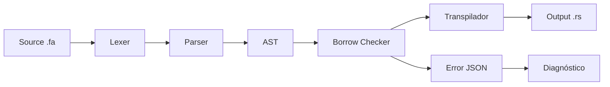
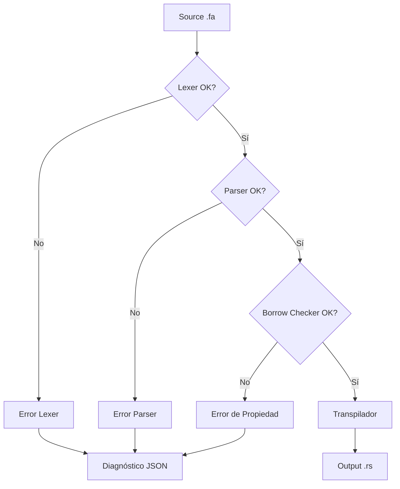

# Plan de Arquitectura: Compilador Forja (fa) → Rust

## Visión General

Compilador/Transpilador escrito en **Rust** que toma código fuente **Forja (fa)** (lenguaje educativo en español) y genera código **Rust (.rs)** válido, utilizando el sistema de Ownership y Préstamos de Rust de forma nativa.

---

## 1. Estructura del Proyecto Rust

```
c:/Users/gaucho/forja/
├── Cargo.toml              # Proyecto único (binario)
├── src/
│   ├── main.rs             # CLI: punto de entrada
│   ├── lib.rs              # Biblioteca: reexporta módulos públicos
│   ├── token.rs            # Definiciones de Token y TokenKind
│   ├── lexer.rs            # Lexer/Scanner: texto → tokens
│   ├── ast.rs              # AST: nodos del árbol sintáctico
│   ├── parser.rs           # Parser: tokens → AST
│   ├── error.rs            # Sistema de errores y diagnóstico JSON
│   ├── semantics.rs        # Borrow Checker de Forja (análisis semántico)
│   └── transpiler.rs       # Generador de código Rust
├── examples/
│   ├── hola_mundo.fa
│   ├── variables.fa
│   ├── condicionales.fa
│   ├── bucles.fa
│   ├── clases.fa
│   └── ownership.fa
└── tests/
    ├── lexer_tests.rs
    ├── parser_tests.rs
    ├── semantics_tests.rs
    └── transpiler_tests.rs
```

**Single crate** es suficiente para esta etapa. Si crece, se refactoriza a workspace.

---

## 2. Pipeline de Compilación



1. **Lexer**: Texto → Tokens (`TokenStream`)
2. **Parser**: Tokens → AST (Árbol de Sintaxis Abstracta)
3. **Borrow Checker**: Recorre el AST → valida ownership y préstamos
4. **Transpilador**: AST validado → código Rust (String)
5. **Error Handler**: Errores → JSON estructurado con sugerencias

---

## 3. Diseño de Módulos

### 3.1 `token.rs` — Definición de Tokens

```rust
#[derive(Debug, Clone, PartialEq)]
pub enum TokenKind {
    // Keywords
    Variable,    // variable
    Mut,         // mut
    Si,          // si
    Sino,        // sino
    Mientras,    // mientras
    Para,        // para
    Repetir,     // repetir
    Clase,       // clase
    Constructor, // constructor
    Este,        // este
    Nuevo,       // nuevo
    Funcion,     // funcion
    Prestado,    // prestado
    Escribir,    // escribir
    BD,          // BD (base de datos)

    // Symbols
    Amp,         // &
    LlaveAbrir,  // {
    LlaveCerrar, // }
    ParenAbrir,  // (
    ParenCerrar, // )
    CorcheteAbr, // [
    CorcheteCerr,// ]
    Coma,        // ,
    Punto,       // .
    DosPuntos,   // :
    PuntoComa,   // ;
    Flecha,      // ->
    Igual,       // =
    Mas,         // +
    Menos,       // -
    Por,         // *
    Dividido,    // /
    Mayor,       // >
    Menor,       // <
    MayorIgual,  // >=
    MenorIgual,  // <=
    IgualIgual,  // ==
    Diferente,   // !=
    Y,           // &&
    O,           // ||

    // Literals
    Identificador(String),
    Numero(i64),
    Texto(String),

    // Special
    EOF,
    Error(char),
}

#[derive(Debug, Clone)]
pub struct Token {
    pub kind: TokenKind,
    pub linea: usize,
    pub columna: usize,
}
```

### 3.2 `lexer.rs` — Tokenizador

```rust
pub struct Lexer {
    source: Vec<char>,
    pos: usize,
    linea: usize,
    columna: usize,
}

impl Lexer {
    pub fn new(source: &str) -> Self { ... }
    pub fn tokenize(&mut self) -> Result<Vec<Token>, Vec<ErrorForja>> { ... }

    // Métodos internos
    fn next_token(&mut self) -> Option<Token> { ... }
    fn identificar_keyword(&self, palabra: &str) -> TokenKind { ... }
    fn leer_identificador(&mut self) -> TokenKind { ... }
    fn leer_numero(&mut self) -> TokenKind { ... }
    fn leer_texto(&mut self) -> Option<TokenKind> { ... }
    fn leer_operador(&mut self) -> TokenKind { ... }
    fn skip_whitespace(&mut self) { ... }
    fn skip_comentario(&mut self) { ... }
}
```

### 3.3 `ast.rs` — Definición del AST

```rust
pub enum Declaracion {
    Variable {
        mutable: bool,
        nombre: String,
        valor: Option<Expresion>,
    },
    Funcion {
        nombre: String,
        parametros: Vec<Parametro>,
        cuerpo: Vec<Declaracion>,
    },
    Clase {
        nombre: String,
        campos: Vec<VariableClase>,
        metodos: Vec<Metodo>,
    },
    // ...
}

pub enum Expresion {
    LiteralNumero(i64),
    LiteralTexto(String),
    Identificador(String),
    Binaria {
        izquierda: Box<Expresion>,
        operador: Operador,
        derecha: Box<Expresion>,
    },
    LlamadaFuncion {
        nombre: String,
        argumentos: Vec<Expresion>,
    },
    AccesoMiembro {
        objeto: Box<Expresion>,
        miembro: String,
    },
    Instanciacion {
        clase: String,
        argumentos: Vec<Expresion>,
    },
    Referencia {
        expr: Box<Expresion>,
    }, // &expr
    // ...
}
```

### 3.4 `parser.rs` — Parsing Recursive Descent

```rust
pub struct Parser {
    tokens: Vec<Token>,
    pos: usize,
}

impl Parser {
    pub fn new(tokens: Vec<Token>) -> Self { ... }
    pub fn parse(&mut self) -> Result<Programa, Vec<ErrorForja>> { ... }

    // Métodos de parsing por categoría
    fn parse_declaracion(&mut self) -> Result<Declaracion, ErrorForja> { ... }
    fn parse_expresion(&mut self) -> Result<Expresion, ErrorForja> { ... }
    fn parse_factor(&mut self) -> Result<Expresion, ErrorForja> { ... }
    fn parse_clase(&mut self) -> Result<Declaracion, ErrorForja> { ... }
    fn parse_si(&mut self) -> Result<Declaracion, ErrorForja> { ... }
    fn parse_mientras(&mut self) -> Result<Declaracion, ErrorForja> { ... }
    fn parse_para(&mut self) -> Result<Declaracion, ErrorForja> { ... }
    fn parse_repetir(&mut self) -> Result<Declaracion, ErrorForja> { ... }
}
```

### 3.5 `error.rs` — Sistema de Diagnóstico

```rust
pub struct ErrorForja {
    pub tipo: ErrorTipo,
    pub linea: usize,
    pub columna: usize,
    pub mensaje: String,
    pub sugerencia: String,
}

pub enum ErrorTipo {
    ErrorSintactico,
    ErrorDePropiedad,
    ErrorDeTipo,
    ErrorSemantico,
}

impl ErrorForja {
    pub fn to_json(&self) -> String {
        serde_json::to_string_pretty(&json!({
            "error": format!("{:?}", self.tipo),
            "linea": self.linea,
            "columna": self.columna,
            "mensaje": self.mensaje,
            "sugerencia": self.sugerencia,
        }))
    }
}
```

### 3.6 `semantics.rs` — Borrow Checker de Forja

Este módulo recorre el AST y verifica:

1. **Variables no declaradas** antes de usar
2. **Variables movidas** (move) → detectar uso después de move
3. **Préstamos inválidos** → referencias que sobreviven al valor original
4. **Mutabilidad correcta** → no mutar variable inmutable
5. **Scope/ámbito** → variables que salen de alcance

```rust
pub struct BorrowChecker {
    tabla_simbolos: TablaSimbolos,
    errores: Vec<ErrorForja>,
}

struct InfoVariable {
    nombre: String,
    mutable: bool,
    movida: bool,       // true si fue movida
    prestada: bool,     // true si tiene préstamos activos
    linea_decl: usize,
}

impl BorrowChecker {
    pub fn new() -> Self { ... }
    pub fn analizar(&mut self, programa: &Programa) -> Result<(), Vec<ErrorForja>> { ... }

    fn check_declaracion(&mut self, decl: &Declaracion) { ... }
    fn check_expresion(&mut self, expr: &Expresion) -> Option<InfoVariable> { ... }
    fn check_move(&mut self, nombre: &str, linea: usize, columna: usize) { ... }
    fn check_prestamo(&mut self, nombre: &str, linea: usize, columna: usize) { ... }
}
```

### 3.7 `transpiler.rs` — Generador de Código Rust

```rust
pub struct Transpiler {
    output: String,
    indent_level: usize,
}

impl Transpiler {
    pub fn new() -> Self { ... }
    pub fn transpilar(&mut self, programa: &Programa) -> Result<String, Vec<ErrorForja>> { ... }

    // Mapeos específicos
    fn transpilar_declaracion(&mut self, decl: &Declaracion) { ... }
    fn transpilar_expresion(&mut self, expr: &Expresion) -> String { ... }
    fn transpilar_clase(&mut self, clase: &Declaracion) { ... }
    fn transpilar_funcion(&mut self, func: &Declaracion) { ... }
    fn transpilar_si(&mut self, si: &Declaracion) { ... }
    fn transpilar_mientras(&mut self, mientras: &Declaracion) { ... }
    fn transpilar_para(&mut self, para: &Declaracion) { ... }
    fn transpilar_repetir(&mut self, repetir: &Declaracion) { ... }

    // Output helpers
    fn emit(&mut self, texto: &str) { ... }
    fn emit_line(&mut self, texto: &str) { ... }
    fn indent(&mut self) { ... }
    fn dedent(&mut self) { ... }
}
```

---

## 4. Mapeo Forja → Rust (Tabla de Traducción)

| Forja (fa) | Rust Generado |
|---|---|
| `variable x = 5` | `let x = 5;` |
| `variable mut x = 5` | `let mut x = 5;` |
| `si (cond) { ... } sino { ... }` | `if cond { ... } else { ... }` |
| `mientras (cond) { ... }` | `while cond { ... }` |
| `para (i = 0; i < 10; i = i + 1) { ... }` | `for i in 0..10 { ... }` |
| `repetir (10) { ... }` | `for _ in 0..10 { ... }` |
| `clase X { ... }` | `struct X { ... }` + `impl X { ... }` |
| `constructor(n) { ... }` | `fn nuevo(n: ...) -> Self { ... }` |
| `este.campo` | `self.campo` |
| `nuevo X(args)` | `X::nuevo(args)` |
| `funcion f(args) { ... }` | `fn f(args) { ... }` |
| `prestado param` | `param: &Tipo` |
| `&expr` | `&expr` |
| `escribir(expr)` | `println!("{}", expr)` |
| `BD("sqlite:memoria")` | `rusqlite::Connection::open_in_memory()` |

---

## 5. Flujo de Error con Diagnóstico JSON



Ejemplo de diagnóstico:

```json
{
  "error": "ErrorDePropiedad",
  "linea": 14,
  "columna": 10,
  "mensaje": "La variable 'config' ya fue movida y no puede ser utilizada de nuevo.",
  "sugerencia": "Si solo querías leer sus datos, intentá pasarla como un préstamo usando '&config'."
}
```

---

## 6. Plan de Implementación por Fases

### FASE 0: Inicialización del Proyecto
- `cargo init` en `c:/Users/gaucho/forja`
- Configurar `Cargo.toml` con dependencias (serde, serde_json)
- Crear estructura de directorios `src/`, `examples/`, `tests/`

### FASE 1: Lexer (token.rs + lexer.rs)
- Definir todos los `TokenKind` y `Token`
- Implementar `Lexer` con `tokenize()`
- Manejo de: keywords, identificadores, números, strings, operadores, símbolos
- Soporte para comentarios de línea (`//`)
- Pruebas unitarias

### FASE 2: Parser Básico (ast.rs + parser.rs)
- Definir AST básico: `Programa`, `Declaracion`, `Expresion`
- Parsear: variables, asignaciones, expresiones aritméticas/lógicas
- Parsear: `si`/`sino`, `mientras`, `para`, `repetir`
- Parsear: `escribir()` (println)
- Pruebas unitarias

### FASE 3: Parser POO + PDO (extensión de parser.rs y ast.rs)
- Parsear: `clase` con campos y métodos
- Parsear: `constructor`, `este`
- Parsear: `nuevo` (instanciación)
- Parsear: acceso a miembros (`.`)
- Parsear: `BD(...)` para capa de datos
- Pruebas unitarias

### FASE 4: Borrow Checker (semantics.rs)
- Implementar tabla de símbolos
- Rastrear: declaración, uso, move, préstamo
- Detectar: uso después de move
- Detectar: préstamo inválido
- Detectar: mutación de variable inmutable
- Generar errores con sugerencias educativas
- Pruebas unitarias

### FASE 5: Transpilador a Rust (transpiler.rs)
- Generar `fn main()` con código transpilado
- Convertir clases a `struct` + `impl`
- Convertir `constructor` a `fn nuevo() -> Self`
- Convertir `escribir` a `println!`
- Manejar tipos: `String`, números, referencias
- Pruebas unitarias

### FASE 6: CLI y Diagnóstico JSON (main.rs + error.rs)
- CLI: `forja archivo.fa -o salida.rs`
- Manejo de errores unificado con salida JSON
- Flags: `--json-errors`, `--emit-ir` (AST dump)
- Pruebas de integración E2E

### FASE 7: Ejemplos y Pruebas
- `hola_mundo.fa`: programa mínimo
- `variables.fa`: mutabilidad y tipos
- `condicionales.fa`: si/sino anidados
- `bucles.fa`: mientras, para, repetir
- `clases.fa`: POO completo
- `ownership.fa`: move, préstamos, referencias
- Pruebas E2E que compilan .fa → .rs y verifican con rustc

---

## 7. Dependencias (Cargo.toml)

```toml
[package]
name = "forja"
version = "0.1.0"
edition = "2021"

[dependencies]
serde = { version = "1", features = ["derive"] }
serde_json = "1"
```

Sin dependencias pesadas. El compilador usa solo std + serde para JSON.

---

## 8. Criterios de Éxito

1. [ ] `forja hola_mundo.fa` genera `hola_mundo.rs` que compila con `rustc`
2. [ ] `forja clases.fa` genera structs + impls correctos en Rust
3. [ ] `forja ownership.fa` detecta errores de move antes de generar Rust
4. [ ] Los errores se muestran en formato JSON legible con sugerencias
5. [ ] Todos los tests pasan (`cargo test`)
