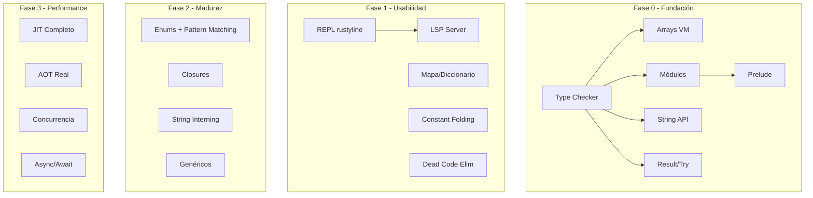

# Guía de Implementación Detallada — Forja Lenguaje Serio

> Documento técnico para que cualquier agente implemente features sin contexto perdido.
> Cada sección especifica: archivos a modificar, estructuras de datos, algoritmos, código de ejemplo, tests.

---

## Convenciones en este documento

- `🔧` = Archivo a modificar
- `🆕` = Nuevo archivo a crear
- `🧪` = Tests a escribir
- `📐` = Estructura de datos / algoritmo
- `📝` = Código de ejemplo

---

## Índice de Implementaciones

1. [F0.1: Type Checker Completo](#f01-type-checker-completo)
2. [F0.2: Arrays en VM](#f02-arrays-en-vm)
3. [F0.3: Sistema de Módulos](#f03-sistema-de-módulos)
4. [F0.4: String API](#f04-string-api)
5. [F0.5: Manejo de Errores Result-Try](#f05-manejo-de-errores-result-try)
6. [F0.6: Mapa/Diccionario](#f06-mapadiccionario)
7. [P1.1: REPL con rustyline](#p11-repl-con-rustyline)
8. [P1.2: Constant Folding](#p12-constant-folding)
9. [P1.3: Dead Code Elimination](#p13-dead-code-elimination)
10. [P1.4: String Interning](#p14-string-interning)
11. [P2.1: Enums + Pattern Matching](#p21-enums--pattern-matching)
12. [P2.2: Closures](#p22-closures)

---

## F0.1: Type Checker Completo

### Objetivo
Que todas las expresiones tengan tipo conocido en tiempo de compilación y se verifique compatibilidad antes de generar bytecode.

### Archivos

| Archivo | Acción |
|---------|--------|
| [`src/ast.rs`](src/ast.rs) | 🔧 Agregar `Tipo::Funcion(Vec<Tipo>, Box<Tipo>)` |
| [`src/semantics.rs`](src/semantics.rs) | 🔧 Reemplazar `analizar_expresion()` con inferencia real |
| [`src/error.rs`](src/error.rs) | 🔧 Activar `ErrorDeTipo` |
| [`src/lib.rs`](src/lib.rs) | 🔧 Agregar fase de Type Checker en pipeline |
| [`src/bytecode.rs`](src/bytecode.rs) | 🔧 Usar tipos inferidos del Type Checker |
| [`src/transpiler.rs`](src/transpiler.rs) | 🔧 Usar tipos inferidos en vez de `inferir_tipo_expr` |

### Estructuras de Datos

```rust
// src/ast.rs — Agregar al enum Tipo
pub enum Tipo {
    Entero,
    Decimal,
    Texto,
    Booleano,
    Nulo,
    Clase(String),
    Arreglo(Box<Tipo>),
    // NUEVOS:
    Funcion(Vec<Tipo>, Box<Tipo>),  // (params, retorno)
    TipoVariable(String),           // para genéricos: T
}

// src/semantics.rs — Tabla de tipos para expresiones
struct TypeChecker {
    tabla_simbolos: TablaSimbolos,       // reusa la existente
    tipos_expresion: HashMap<usize, Tipo>, // id_expresion -> tipo
    errores: Vec<ErrorForja>,
    id_counter: usize,
}
```

### Algoritmo de Inferencia

```rust
impl TypeChecker {
    pub fn analizar(&mut self, programa: &Programa) -> Result<(), Vec<ErrorForja>> {
        // Pasada 1: recolectar declaraciones de funciones/clases
        self.pasada_recoleccion(&programa.declaraciones);
        // Pasada 2: inferir tipos de todas las expresiones
        self.pasada_inferencia(&programa.declaraciones);
        // Pasada 3: verificar compatibilidad
        self.pasada_verificacion(&programa.declaraciones);
        
        if self.errores.is_empty() { Ok(()) } else { Err(self.errores.clone()) }
    }

    fn inferir_tipo_expresion(&mut self, expr: &Expresion) -> Option<Tipo> {
        match expr {
            Expresion::LiteralNumero(_) => Some(Tipo::Entero),
            Expresion::LiteralDecimal(_) => Some(Tipo::Decimal),
            Expresion::LiteralTexto(_) => Some(Tipo::Texto),
            Expresion::LiteralBooleano(_) => Some(Tipo::Booleano),
            Expresion::LiteralNulo => Some(Tipo::Nulo),
            Expresion::Identificador(nombre) => {
                self.tabla_simbolos.obtener(nombre)
                    .and_then(|info| info.tipo.clone())
            }
            Expresion::Binaria { izquierda, operador, derecha } => {
                let t_izq = self.inferir_tipo_expresion(izquierda);
                let t_der = self.inferir_tipo_expresion(derecha);
                match operador {
                    Operador::Suma => self.tipo_suma(t_izq, t_der),
                    Operador::Resta | Operador::Multiplicacion | Operador::Division => {
                        // Ambos deben ser numéricos
                        self.verificar_numerico(t_izq, t_der, "operación aritmética")
                    }
                    Operador::Mayor | Operador::Menor | Operador::MayorIgual
                    | Operador::MenorIgual | Operador::IgualIgual | Operador::Diferente => {
                        // Ambos deben ser del mismo tipo comparable
                        self.verificar_comparable(t_izq, t_der, "comparación")
                    }
                    Operador::Y | Operador::O => {
                        // Ambos deben ser booleanos
                        self.verificar_booleano(t_izq, t_der, "operación lógica")
                    }
                }
            }
            Expresion::LlamadaFuncion { nombre, argumentos } => {
                let tipos_args: Vec<Option<Tipo>> = argumentos.iter()
                    .map(|a| self.inferir_tipo_expresion(a))
                    .collect();
                self.buscar_tipo_funcion(nombre, &tipos_args)
            }
            Expresion::Arreglo(elementos) => {
                let tipos_elem: Vec<Option<Tipo>> = elementos.iter()
                    .map(|e| self.inferir_tipo_expresion(e))
                    .collect();
                // Todos los elementos deben ser del mismo tipo
                if let Some(primer_tipo) = tipos_elem.first().and_then(|t| t.clone()) {
                    for t in &tipos_elem[1..] {
                        if t.as_ref() != Some(&primer_tipo) {
                            self.errores.push(ErrorForja::new(
                                ErrorTipo::ErrorDeTipo, 0, 0,
                                "Todos los elementos del arreglo deben ser del mismo tipo",
                                "Usá el mismo tipo para todos los elementos",
                            ));
                        }
                    }
                    Some(Tipo::Arreglo(Box::new(primer_tipo)))
                } else {
                    Some(Tipo::Arreglo(Box::new(Tipo::Nulo)))
                }
            }
            Expresion::Instanciacion { clase, argumentos } => {
                Some(Tipo::Clase(clase.clone()))
            }
            _ => None
        }
    }

    fn tipo_suma(&self, a: Option<Tipo>, b: Option<Tipo>) -> Option<Tipo> {
        match (a, b) {
            (Some(Tipo::Entero), Some(Tipo::Entero)) => Some(Tipo::Entero),
            (Some(Tipo::Decimal), Some(Tipo::Decimal)) => Some(Tipo::Decimal),
            (Some(Tipo::Entero), Some(Tipo::Decimal)) => Some(Tipo::Decimal),
            (Some(Tipo::Decimal), Some(Tipo::Entero)) => Some(Tipo::Decimal),
            (Some(Tipo::Texto), Some(Tipo::Texto)) => Some(Tipo::Texto),
            (Some(Tipo::Texto), Some(Tipo::Entero)) => Some(Tipo::Texto),
            (Some(Tipo::Texto), Some(Tipo::Decimal)) => Some(Tipo::Texto),
            (Some(Tipo::Texto), Some(Tipo::Booleano)) => Some(Tipo::Texto),
            _ => None // Error de tipos
        }
    }
}
```

### Pipeline Modificado en [`src/lib.rs`](src/lib.rs)

```rust
pub fn compilar(source: &str) -> Result<String, Vec<ErrorForja>> {
    let mut lexer = lexer::Lexer::new(source);
    let tokens = lexer.tokenize()?;
    let mut parser = parser::Parser::new(tokens);
    let programa = parser.parse()?;

    // NUEVA FASE: Type Checker (antes del Borrow Checker)
    let mut type_checker = semantics::TypeChecker::new();
    type_checker.analizar(&programa)?;

    // FASE 4: Borrow Checker (puede usar tipos inferidos)
    let mut checker = semantics::BorrowChecker::new();
    checker.analizar(&programa)?;

    // FASE 5: Transpilador (usa tipos del Type Checker)
    let mut transpiler = transpiler::Transpiler::new();
    transpiler.cargar_tipos(type_checker.obtener_tipos()); // NUEVO
    let rust_code = transpiler.transpilar(&programa)?;

    Ok(rust_code)
}
```

### 🧪 Tests

```rust
#[test]
fn test_type_checker_suma_entero_decimal() {
    // 3 + 2.5 → Decimal
    let result = type_checkear("variable x = 3 + 2.5").unwrap();
    assert_eq!(result.tipo("x"), Some(Tipo::Decimal));
}

#[test]
fn test_type_checker_error_texto_mas_entero() {
    // "hola" + 5 → debería ser error
    let result = type_checkear("escribir(\"hola\" + 5)");
    assert!(result.is_err());
}

#[test]
fn test_type_checker_comparacion_tipos_distintos() {
    // 5 > "hola" → error
    let result = type_checkear("escribir(5 > \"hola\")");
    assert!(result.is_err());
}

#[test]
fn test_type_checker_arreglo_homogeneo() {
    let result = type_checkear("variable arr = [1, 2, 3]").unwrap();
    assert_eq!(result.tipo("arr"), Some(Tipo::Arreglo(Box::new(Tipo::Entero))));
}
```

---

## F0.2: Arrays en VM

### Objetivo
Soportar arrays `[1, 2, 3]` en la VM con acceso por índice `arr[0]`, asignación `arr[0] = 10`, y longitud `arr.length()`.

### Archivos

| Archivo | Acción |
|---------|--------|
| [`src/ast.rs`](src/ast.rs) | ✅ Ya existe `Expresion::Arreglo` |
| [`src/ast.rs`](src/ast.rs) | 🔧 Agregar `Expresion::Index { objeto, indice }` |
| [`src/ast.rs`](src/ast.rs) | 🔧 Agregar `Declaracion::AsignacionIndex { objeto, indice, valor }` |
| [`src/token.rs`](src/token.rs) | ✅ Ya existe `CorcheteAbrir`, `CorcheteCerrar` |
| [`src/lexer.rs`](src/lexer.rs) | ✅ Ya soporta `[` y `]` |
| [`src/parser.rs`](src/parser.rs) | 🔧 Parsear `arr[0]` como `Expresion::Index` |
| [`src/bytecode.rs`](src/bytecode.rs) | 🔧 Agregar opcodes `ArrayNew`, `ArrayGet`, `ArraySet`, `ArrayLen` |
| [`src/vm.rs`](src/vm.rs) | 🔧 Agregar `ValorVM::Arreglo(Vec<ValorVM>)`, implementar opcodes |
| [`src/vm.rs`](src/vm.rs) | 🔧 Implementar `ArrayGet`, `ArraySet`, `ArrayLen` en el loop |

### Nuevos Opcodes en [`src/bytecode.rs`](src/bytecode.rs)

```rust
pub enum Opcode {
    // ... existentes ...
    
    // === Arrays (NUEVOS) ===
    ArrayNew(usize),        // Crear array con N elementos (pop N de la pila)
    ArrayGet,               // Pop índice, pop array, push valor
    ArraySet,               // Pop valor, pop índice, pop array (asigna in-place)
    ArrayLen,               // Pop array, push longitud (i64)
}
```

### Serialización en [`src/bytecode.rs`](src/bytecode.rs)

```rust
fn opcode_to_byte(op: &Opcode) -> u8 {
    match op {
        // ... existentes ...
        Opcode::ArrayNew(_) => 80,
        Opcode::ArrayGet => 81,
        Opcode::ArraySet => 82,
        Opcode::ArrayLen => 83,
    }
}

fn byte_to_opcode(byte: u8) -> Option<Opcode> {
    match byte {
        // ... existentes ...
        80 => Some(Opcode::ArrayNew(0)),
        81 => Some(Opcode::ArrayGet),
        82 => Some(Opcode::ArraySet),
        83 => Some(Opcode::ArrayLen),
    }
}
```

### Generación de Bytecode en [`src/bytecode.rs`](src/bytecode.rs)

```rust
fn generar_expresion(&mut self, expr: &Expresion) {
    match expr {
        // ... existentes ...
        
        Expresion::Arreglo(elementos) => {
            for elem in elementos {
                self.generar_expresion(elem);
            }
            self.emitir(Opcode::ArrayNew(elementos.len()));
        }

        // NUEVO: arr[0]
        Expresion::Index { objeto, indice } => {
            self.generar_expresion(objeto);
            self.generar_expresion(indice);
            self.emitir(Opcode::ArrayGet);
        }
    }
}

fn generar_declaracion(&mut self, decl: &Declaracion) {
    match decl {
        // NUEVO: arr[0] = 10
        Declaracion::AsignacionIndex { objeto, indice, valor } => {
            self.generar_expresion(valor);
            self.generar_expresion(objeto);
            self.generar_expresion(indice);
            self.emitir(Opcode::ArraySet);
        }
    }
}
```

### Implementación en VM [`src/vm.rs`](src/vm.rs)

```rust
pub enum ValorVM {
    Entero(i64),
    Decimal(f64),
    Texto(String),
    Booleano(bool),
    Nulo,
    Objeto(ObjetoRef),
    // NUEVO:
    Arreglo(Vec<ValorVM>),
}

impl ValorVM {
    pub fn mostrar(&self) -> String {
        match self {
            // ... existentes ...
            ValorVM::Arreglo(elementos) => {
                let elems: Vec<String> = elementos.iter().map(|e| e.mostrar()).collect();
                format!("[{}]", elems.join(", "))
            }
        }
    }
}
```

En el loop de ejecución:

```rust
Opcode::ArrayNew(n) => {
    let mut elementos = Vec::with_capacity(n);
    for _ in 0..n {
        let val = self.stack.pop()
            .ok_or(ErrorVM::StackUnderflow("ArrayNew".to_string()))?;
        elementos.push(val);
    }
    elementos.reverse(); // porque pop da orden inverso
    self.stack.push(ValorVM::Arreglo(elementos));
}

Opcode::ArrayGet => {
    let idx = self.stack.pop()
        .ok_or(ErrorVM::StackUnderflow("ArrayGet idx".to_string()))?;
    let arr = self.stack.pop()
        .ok_or(ErrorVM::StackUnderflow("ArrayGet arr".to_string()))?;
    match (arr, idx) {
        (ValorVM::Arreglo(elementos), ValorVM::Entero(i)) => {
            let i = i as usize;
            if i >= elementos.len() {
                self.stack.push(ValorVM::Nulo);
            } else {
                self.stack.push(elementos[i].clone());
            }
        }
        _ => return Err(ErrorVM::TipoIncompatible("ArrayGet: se esperaba arreglo[entero]".to_string())),
    }
}

Opcode::ArraySet => {
    let valor = self.stack.pop()
        .ok_or(ErrorVM::StackUnderflow("ArraySet val".to_string()))?;
    let idx = self.stack.pop()
        .ok_or(ErrorVM::StackUnderflow("ArraySet idx".to_string()))?;
    let arr = self.stack.pop()
        .ok_or(ErrorVM::StackUnderflow("ArraySet arr".to_string()))?;
    match (arr, idx) {
        (ValorVM::Arreglo(mut elementos), ValorVM::Entero(i)) => {
            let i = i as usize;
            if i < elementos.len() {
                elementos[i] = valor;
            }
            // Arreglo modificado, pero queda en la variable original
            // por la semántica de Clone. Necesitamos mutabilidad.
        }
        _ => return Err(ErrorVM::TipoIncompatible("ArraySet: se esperaba arreglo[entero]".to_string())),
    }
}

Opcode::ArrayLen => {
    let arr = self.stack.pop()
        .ok_or(ErrorVM::StackUnderflow("ArrayLen".to_string()))?;
    match arr {
        ValorVM::Arreglo(elementos) => {
            self.stack.push(ValorVM::Entero(elementos.len() as i64));
        }
        _ => return Err(ErrorVM::TipoIncompatible("ArrayLen: se esperaba arreglo".to_string())),
    }
}
```

### Parseo de `arr[0]` en [`src/parser.rs`](src/parser.rs)

Agregar en `parse_post_identificador` y `parse_expresion_primaria`:

```rust
// En parse_expresion_primaria, después de parsear un identificador:
if self.coincide(TokenKind::CorcheteAbrir) {
    return self.parse_index(Expresion::Identificador(nombre));
}

// Nuevo método:
fn parse_index(&mut self, objeto: Expresion) -> Result<Expresion, ErrorForja> {
    self.avanzar(); // consume [
    let indice = self.parse_expresion()?;
    self.esperar(TokenKind::CorcheteCerrar, "Se esperaba ']' después del índice.")?;
    Ok(Expresion::Index {
        objeto: Box::new(objeto),
        indice: Box::new(indice),
    })
}
```

### 🧪 Tests

```rust
#[test]
fn test_vm_array_literal() {
    let vm = ejecutar_source("variable arr = [1, 2, 3]\nescribir(arr)").unwrap();
    assert_eq!(vm.obtener_output(), &["[1, 2, 3]"]);
}

#[test]
fn test_vm_array_get() {
    let vm = ejecutar_source("variable arr = [10, 20, 30]\nescribir(arr[1])").unwrap();
    assert_eq!(vm.obtener_output(), &["20"]);
}

#[test]
fn test_vm_array_len() {
    let vm = ejecutar_source("variable arr = [1, 2, 3, 4, 5]\nescribir(arr.length())").unwrap();
    // Nota: implementar length como método nativo o función
}

#[test]
fn test_e2e_array() {
    let out = ejecutar(
        "variable arr = [1, 2, 3]
         arr[1] = 99
         escribir(arr[1])"
    ).unwrap();
    assert_eq!(out, vec!["99"]);
}
```

---

## F0.3: Sistema de Módulos

### Objetivo
Soportar `importar "archivo"` para dividir código en múltiples archivos.

### Arquitectura

```mermaid
flowchart TD
    A[main.fa] --> B[importar "math"]
    A --> C[importar "io/archivos"]
    B --> D[Resolver ruta: math.fa]
    C --> E[Resolver ruta: io/archivos.fa]
    D --> F[Lexer + Parser]
    E --> F
    F --> G[ASTs combinados]
    G --> H[Type Checker global]
    H --> I[Bytecode/Transpilador]
```

### Archivos

| Archivo | Acción |
|---------|--------|
| [`src/ast.rs`](src/ast.rs) | 🔧 Agregar `Declaracion::Importar(String)` |
| [`src/token.rs`](src/token.rs) | 🔧 Agregar keyword `Importar` |
| [`src/lexer.rs`](src/lexer.rs) | 🔧 Agregar `"importar"` como keyword |
| [`src/parser.rs`](src/parser.rs) | 🔧 Parsear `importar "ruta"` |
| [`src/module.rs`](src/module.rs) | 🆕 Resolvedor de módulos, cache de ASTs |
| [`src/lib.rs`](src/lib.rs) | 🔧 Integrar módulos en pipeline |

### Nuevo archivo: [`src/module.rs`](src/module.rs)

```rust
use std::collections::HashMap;
use std::path::{Path, PathBuf};
use crate::ast::*;
use crate::lexer::Lexer;
use crate::parser::Parser;
use crate::error::ErrorForja;

/// Resolvedor de módulos: carga archivos .fa, parsea, combina ASTs
pub struct ModuleResolver {
    /// Directorio raíz de búsqueda
    root_dir: PathBuf,
    /// Cache de módulos ya cargados (ruta -> AST)
    cache: HashMap<String, Programa>,
    /// Archivos actualmente en proceso (para detectar ciclos)
    en_proceso: Vec<String>,
}

impl ModuleResolver {
    pub fn new(root_dir: &str) -> Self {
        ModuleResolver {
            root_dir: PathBuf::from(root_dir),
            cache: HashMap::new(),
            en_proceso: Vec::new(),
        }
    }

    /// Resuelve una declaración de importación y combina su AST
    pub fn resolver_importar(&mut self, ruta: &str) -> Result<Programa, Vec<ErrorForja>> {
        // Detectar ciclos
        if self.en_proceso.contains(&ruta.to_string()) {
            return Err(vec![ErrorForja::new(
                ErrorTipo::ErrorSemantico, 0, 0,
                &format!("Importación cíclica detectada: '{}'", ruta),
                "Asegurate de que no haya dependencias circulares entre módulos.",
            )]);
        }

        // Buscar en cache
        if let Some(programa) = self.cache.get(ruta) {
            return Ok(programa.clone());
        }

        // Resolver ruta del archivo
        let path = self.resolver_ruta(ruta)?;

        // Leer archivo
        let source = std::fs::read_to_string(&path)
            .map_err(|e| vec![ErrorForja::new(
                ErrorTipo::ErrorSemantico, 0, 0,
                &format!("No se pudo leer el módulo '{}': {}", ruta, e),
                "Verificá que el archivo exista en las rutas de búsqueda.",
            )])?;

        // Parsear
        let mut lexer = Lexer::new(&source);
        let tokens = lexer.tokenize()?;
        let mut parser = Parser::new(tokens);
        let mut programa = parser.parse()?;

        // Resolver importaciones anidadas
        self.en_proceso.push(ruta.to_string());
        let mut declaraciones_finales = Vec::new();
        for decl in programa.declaraciones {
            if let Declaracion::Importar(ref sub_ruta) = decl {
                let sub_prog = self.resolver_importar(sub_ruta)?;
                declaraciones_finales.extend(sub_prog.declaraciones);
            } else {
                declaraciones_finales.push(decl);
            }
        }
        self.en_proceso.pop();

        programa.declaraciones = declaraciones_finales;
        self.cache.insert(ruta.to_string(), programa.clone());
        Ok(programa)
    }

    fn resolver_ruta(&self, ruta: &str) -> Result<PathBuf, Vec<ErrorForja>> {
        // Estrategia de búsqueda:
        // 1. root_dir / ruta.fa
        // 2. root_dir / ruta / mod.fa
        
        let candidatos = vec![
            self.root_dir.join(format!("{}.fa", ruta)),
            self.root_dir.join(&ruta).join("mod.fa"),
        ];

        for c in candidatos {
            if c.exists() {
                return Ok(c);
            }
        }

        Err(vec![ErrorForja::new(
            ErrorTipo::ErrorSemantico, 0, 0,
            &format!("Módulo '{}' no encontrado", ruta),
            "Creá el archivo o verificá que la ruta sea correcta.",
        )])
    }

    /// Combina múltiples programas en uno solo
    pub fn combinar(programas: Vec<Programa>) -> Programa {
        let mut declaraciones = Vec::new();
        for p in programas {
            declaraciones.extend(p.declaraciones);
        }
        Programa { declaraciones }
    }
}
```

### Token y Lexer

```rust
// src/token.rs
pub enum TokenKind {
    // ... existentes ...
    Importar,  // NUEVO
}

// src/lexer.rs
fn identificar_keyword(&self, palabra: &str) -> TokenKind {
    match palabra {
        // ... existentes ...
        "importar" => TokenKind::Importar,  // NUEVO
    }
}
```

### Parser: `importar "ruta"`

```rust
// En parse_declaracion:
TokenKind::Importar => self.parse_importar(),

fn parse_importar(&mut self) -> Result<Option<Declaracion>, ErrorForja> {
    self.avanzar(); // consume 'importar'
    let ruta = match &self.peek().kind {
        TokenKind::Texto(s) => s.clone(),
        _ => return Err(ErrorForja::new(
            ErrorTipo::ErrorSintactico, self.linea_actual(), self.columna_actual(),
            "Se esperaba una ruta después de 'importar'.",
            "Ejemplo: importar \"math\"",
        )),
    };
    self.avanzar(); // consume la ruta
    Ok(Some(Declaracion::Importar(ruta)))
}
```

### Pipeline en [`src/lib.rs`](src/lib.rs)

```rust
pub fn ejecutar_con_modulos(archivo_principal: &str) -> Result<Vec<String>, String> {
    let source = std::fs::read_to_string(archivo_principal)
        .map_err(|e| format!("Error leyendo '{}': {}", archivo_principal, e))?;

    let dir = std::path::Path::new(archivo_principal)
        .parent().unwrap_or(std::path::Path::new("."))
        .to_string_lossy().to_string();

    let mut module_resolver = module::ModuleResolver::new(&dir);
    
    // Parsear principal (que puede tener imports)
    let mut lexer = Lexer::new(&source);
    let tokens = lexer.tokenize().map_err(|e| format!("{}", e[0]))?;
    let mut parser = Parser::new(tokens);
    let programa_base = parser.parse().map_err(|e| format!("{}", e[0]))?;

    // Resolver imports
    let mut todas_las_decls = Vec::new();
    for decl in programa_base.declaraciones {
        if let Declaracion::Importar(ruta) = &decl {
            let sub_prog = module_resolver.resolver_importar(ruta)
                .map_err(|e| format!("{}", e[0]))?;
            todas_las_decls.extend(sub_prog.declaraciones);
        } else {
            todas_las_decls.push(decl);
        }
    }

    let programa = Programa { declaraciones: todas_las_decls };
    
    // Continuar con bytecode y VM...
    let mut gen = BytecodeGenerator::new();
    let bytecode = gen.generar(&programa).map_err(|_| "Error bytecode".to_string())?;
    let mut vm = ForjaVM::new();
    vm.cargar_bytecode(bytecode);
    vm.ejecutar().map_err(|e| format!("{}", e))?;
    Ok(vm.obtener_output().to_vec())
}
```

### 🧪 Tests

```rust
#[test]
fn test_importar_modulo_simple() {
    // Crear archivo temporal "math.fa":
    // funcion cuadrado(x) { retornar x * x }
    // En test:
    let out = ejecutar_con_modulos("test_import_data/main.fa").unwrap();
    assert_eq!(out, vec!["16"]);
}

#[test]
fn test_importar_no_encontrado() {
    let result = ejecutar("importar \"no_existe\"");
    assert!(result.is_err());
}
```

---

## F0.4: String API

### Objetivo
Agregar métodos nativos para strings: `.length()`, `.split()`, `.trim()`, `.to_upper()`, `.to_lower()`, `.contains()`, `.reverse()`, y soporte de índice `str[0]`.

### Arquitectura

Los métodos de string se implementan como **built-in functions** que la VM reconoce por nombre:

```rust
enum BuiltinMethod {
    Length,
    Split,
    Trim,
    ToUpper,
    ToLower,
    Contains,
    Reverse,
    Substring,
    Index(usize),  // str[0] desugarizado a str.index(0) en bytecode
}

fn resolver_builtin(tipo: &str, metodo: &str) -> Option<BuiltinMethod> {
    match (tipo, metodo) {
        ("Texto", "length") => Some(BuiltinMethod::Length),
        ("Texto", "split") => Some(BuiltinMethod::Split),
        ("Texto", "trim") => Some(BuiltinMethod::Trim),
        ("Texto", "to_upper") => Some(BuiltinMethod::ToUpper),
        ("Texto", "to_lower") => Some(BuiltinMethod::ToLower),
        ("Texto", "contains") => Some(BuiltinMethod::Contains),
        ("Texto", "reverse") => Some(BuiltinMethod::Reverse),
        _ => None,
    }
}
```

### Archivos

| Archivo | Acción |
|---------|--------|
| [`src/vm.rs`](src/vm.rs) | 🔧 Agregar `BuiltinMethod` enum y handler en `CallMethod` |
| [`src/bytecode.rs`](src/bytecode.rs) | 🔧 Detectar métodos builtin y emitir opcode especial o manejar como CallMethod |
| [`src/transpiler.rs`](src/transpiler.rs) | 🔧 Transpilar `.length()` a `.len()`, `.to_upper()` a `.to_uppercase()`, etc. |

### Implementación en VM

```rust
// En el handler de Opcode::CallMethod en ForjaVM::ejecutar:
Opcode::CallMethod(metodo, nargs) => {
    // Detectar si es un método builtin de string
    if let Some(builtin) = resolver_builtin_metodo(&metodo) {
        self.ejecutar_builtin(builtin, nargs)?;
    } else {
        // Lógica existente de búsqueda en funciones
        // ...
    }
}

fn ejecutar_builtin(&mut self, builtin: BuiltinMethod, nargs: usize) -> Result<(), ErrorVM> {
    match builtin {
        BuiltinMethod::Length => {
            let s = self.stack.pop()
                .ok_or(ErrorVM::StackUnderflow("Length".to_string()))?;
            match s {
                ValorVM::Texto(t) => self.stack.push(ValorVM::Entero(t.len() as i64)),
                _ => return Err(ErrorVM::TipoIncompatible("length: se esperaba texto".to_string())),
            }
        }
        BuiltinMethod::ToUpper => {
            let s = self.stack.pop()
                .ok_or(ErrorVM::StackUnderflow("ToUpper".to_string()))?;
            match s {
                ValorVM::Texto(t) => self.stack.push(ValorVM::Texto(t.to_uppercase())),
                _ => return Err(ErrorVM::TipoIncompatible("to_upper: se esperaba texto".to_string())),
            }
        }
        BuiltinMethod::Contains => {
            let sub = self.stack.pop()
                .ok_or(ErrorVM::StackUnderflow("Contains sub".to_string()))?;
            let s = self.stack.pop()
                .ok_or(ErrorVM::StackUnderflow("Contains str".to_string()))?;
            match (s, sub) {
                (ValorVM::Texto(t), ValorVM::Texto(sub)) => {
                    self.stack.push(ValorVM::Booleano(t.contains(&sub)));
                }
                _ => return Err(ErrorVM::TipoIncompatible("contains: se esperaba texto".to_string())),
            }
        }
        BuiltinMethod::Split => {
            let sep = self.stack.pop()
                .ok_or(ErrorVM::StackUnderflow("Split sep".to_string()))?;
            let s = self.stack.pop()
                .ok_or(ErrorVM::StackUnderflow("Split str".to_string()))?;
            match (s, sep) {
                (ValorVM::Texto(t), ValorVM::Texto(sep)) => {
                    let partes: Vec<ValorVM> = t.split(&sep)
                        .map(|p| ValorVM::Texto(p.to_string()))
                        .collect();
                    self.stack.push(ValorVM::Arreglo(partes));
                }
                _ => return Err(ErrorVM::TipoIncompatible("split: se esperaba texto".to_string())),
            }
        }
        BuiltinMethod::Trim => {
            let s = self.stack.pop()
                .ok_or(ErrorVM::StackUnderflow("Trim".to_string()))?;
            match s {
                ValorVM::Texto(t) => self.stack.push(ValorVM::Texto(t.trim().to_string())),
                _ => return Err(ErrorVM::TipoIncompatible("trim: se esperaba texto".to_string())),
            }
        }
        BuiltinMethod::Reverse => {
            let s = self.stack.pop()
                .ok_or(ErrorVM::StackUnderflow("Reverse".to_string()))?;
            match s {
                ValorVM::Texto(t) => {
                    let rev: String = t.chars().rev().collect();
                    self.stack.push(ValorVM::Texto(rev));
                }
                _ => return Err(ErrorVM::TipoIncompatible("reverse: se esperaba texto".to_string())),
            }
        }
    }
    Ok(())
}
```

### Transpilador [`src/transpiler.rs`](src/transpiler.rs)

```rust
// En transpilar_expresion para AccesoMiembro + llamada a método:
Expresion::AccesoMiembro { objeto, miembro } => {
    let obj_str = self.transpilar_expresion(objeto);
    // Detectar métodos builtin de string y mapear a Rust
    match miembro.as_str() {
        "length" => format!("{}.len()", obj_str),
        "to_upper" => format!("{}.to_uppercase()", obj_str),
        "to_lower" => format!("{}.to_lowercase()", obj_str),
        "contains" => format!("{}.contains(...)", obj_str), // manejar args
        "trim" => format!("{}.trim()", obj_str),
        "split" => format!("{}.split(...)", obj_str),
        _ => format!("{}.{}", obj_str, miembro), // default
    }
}
```

### 🧪 Tests

```rust
#[test]
fn test_string_length() {
    let vm = ejecutar_source("escribir(\"hola\".length())").unwrap();
    assert_eq!(vm.obtener_output(), &["4"]);
}

#[test]
fn test_string_to_upper() {
    let vm = ejecutar_source("escribir(\"hola\".to_upper())").unwrap();
    assert_eq!(vm.obtener_output(), &["HOLA"]);
}

#[test]
fn test_string_contains() {
    let vm = ejecutar_source("escribir(\"hello world\".contains(\"world\"))").unwrap();
    assert_eq!(vm.obtener_output(), &["verdadero"]);
}

#[test]
fn test_string_split() {
    let vm = ejecutar_source("variable partes = \"a,b,c\".split(\",\")\nescribir(partes[0])").unwrap();
    assert_eq!(vm.obtener_output(), &["a"]);
}
```

---

## F0.5: Manejo de Errores Result-Try

### Objetivo
Implementar tipos `Resultado<T, E>` y `Opcion<T>` con pattern matching `coincidir` y operador `?` para propagación de errores.

### Cambios en AST

```rust
// src/ast.rs — Nuevas expresiones
pub enum Expresion {
    // ... existentes ...
    
    // NUEVOS:
    /// Operador ? (propagación de error): expr?
    PropagacionError(Box<Expresion>),
    
    /// Pattern matching: coincidir x { caso Exito(v) -> ... caso Error(e) -> ... }
    Coincidir {
        expr: Box<Expresion>,
        brazos: Vec<BrazoCoincidir>,
    },
}

pub struct BrazoCoincidir {
    pub patron: Patron,
    pub cuerpo: Vec<Declaracion>,
}

pub enum Patron {
    /// Variable que captura cualquier valor: caso x ->
    Variable(String),
    /// Literal: caso 5 ->
    Literal(Expresion),
    /// Constructor con sub-patrones: caso Exito(v) ->
    Constructor(String, Vec<Patron>),
    /// Ignorar: caso _ ->
    Ignorar,
}
```

### Built-in Types (nuevo archivo [`src/prelude.rs`](src/prelude.rs))

```rust
/// Tipos predefinidos del lenguaje (disponibles sin importar)
pub fn declarar_prelude() -> Vec<Declaracion> {
    vec![
        // enum Opcion<T> { Algo(T), Nada }
        Declaracion::Enum {
            nombre: "Opcion".to_string(),
            parametros: vec!["T".to_string()],
            variantes: vec![
                Variante { nombre: "Algo".to_string(), tipos: vec![Tipo::TipoVariable("T".to_string())] },
                Variante { nombre: "Nada".to_string(), tipos: vec![] },
            ],
        },
        
        // enum Resultado<T, E> { Exito(T), Error(E) }
        Declaracion::Enum {
            nombre: "Resultado".to_string(),
            parametros: vec!["T".to_string(), "E".to_string()],
            variantes: vec![
                Variante { nombre: "Exito".to_string(), tipos: vec![Tipo::TipoVariable("T".to_string())] },
                Variante { nombre: "Error".to_string(), tipos: vec![Tipo::TipoVariable("E".to_string())] },
            ],
        },
    ]
}
```

### Operador `?` en Bytecode

```rust
// src/bytecode.rs
Expresion::PropagacionError(expr) => {
    // Generar: resultado = expr
    //          coincidir resultado {
    //              caso Error(e) -> retornar Error(e)
    //              caso Exito(v) -> v (dejar en pila)
    //          }
    // ...
}
```

### 🧪 Tests

```rust
#[test]
fn test_result_exito() {
    let vm = ejecutar_source(
        "funcion dividir(a, b) {
             si (b == 0) { retornar Error(\"div by zero\") }
             retornar Exito(a / b)
         }
         variable r = dividir(10, 2)?
         escribir(r)"
    ).unwrap();
    assert_eq!(vm.obtener_output(), &["5"]);
}

#[test]
fn test_opcion_nada() {
    let vm = ejecutar_source(
        "variable x = Nada
         coincidir x {
             caso Algo(v) -> escribir(\"tiene valor\")
             caso Nada -> escribir(\"no tiene\")
         }"
    ).unwrap();
    assert_eq!(vm.obtener_output(), &["no tiene"]);
}
```

---

## F0.6: Mapa/Diccionario

### Objetivo
Soporte para `{"clave": valor, ...}` con acceso `mapa["clave"]`, asignación `mapa["clave"] = nuevo`, métodos `.keys()`, `.values()`, `.has()`.

### Cambios en AST y Bytecode

```rust
// src/ast.rs
pub enum Expresion {
    // ... existentes ...
    
    /// Mapa literal: {"clave": valor, ...}
    Mapa(Vec<(Expresion, Expresion)>),  // (key, value) pairs
}

// src/bytecode.rs
pub enum Opcode {
    // ... existentes ...
    MapNew(usize),           // Crear mapa con N pares
    MapGet,                  // Pop clave, pop mapa, push valor
    MapSet,                  // Pop valor, pop clave, pop mapa
    MapKeys,                 // Pop mapa, push arreglo de claves
    MapValues,               // Pop mapa, push arreglo de valores
    MapHas,                  // Pop clave, pop mapa, push booleano
}

// src/vm.rs
pub enum ValorVM {
    // ... existentes ...
    Mapa(HashMap<String, ValorVM>),  // claves siempre string por ahora
}
```

### 🧪 Tests

```rust
#[test]
fn test_mapa_literal() {
    let vm = ejecutar_source(
        "variable m = {\"nombre\": \"Ana\", \"edad\": 30}
         escribir(m[\"nombre\"])"
    ).unwrap();
    assert_eq!(vm.obtener_output(), &["Ana"]);
}

#[test]
fn test_mapa_has() {
    let vm = ejecutar_source(
        "variable m = {\"x\": 1}
         escribir(m.has(\"x\"))
         escribir(m.has(\"y\"))"
    ).unwrap();
    assert_eq!(vm.obtener_output(), &["verdadero", "falso"]);
}
```

---

## P1.1: REPL con rustyline

### Objetivo
REPL con historial de comandos, autocompletado de palabras clave, edición multilínea.

### Dependencia

```toml
# Cargo.toml
[dependencies]
rustyline = "14"
```

### Implementación [`src/repl.rs`](src/repl.rs)

```rust
use rustyline::{Editor, Config, history::FileHistory};
use rustyline::completion::{Completer, Pair};
use rustyline::highlight::Highlighter;
use rustyline::hint::Hinter;
use rustyline::validate::{Validator, ValidationResult, ValidationContext};

pub struct REPL {
    vm: ForjaVM,
    rl: Editor<(), FileHistory>,
    buffer: String,
}

/// Autocompletador de palabras clave Forja
struct ForjaCompleter;

impl Completer for ForjaCompleter {
    type Candidate = Pair;

    fn complete(&self, line: &str, pos: usize, _ctx: &Context<'_>)
        -> Result<(usize, Vec<Pair>), ReadlineError>
    {
        let keywords = [
            "variable", "constante", "mut", "si", "sino", "mientras",
            "para", "repetir", "clase", "constructor", "funcion",
            "nuevo", "este", "prestado", "retornar", "escribir",
            "verdadero", "falso", "nulo", "importar", "coincidir",
            "Texto", "Entero", "Decimal", "Booleano",
        ];
        let line_before = &line[..pos];
        let word_start = line_before.rfind(|c: char| !c.is_alphanumeric() && c != '_')
            .map(|i| i + 1).unwrap_or(0);
        let prefix = &line_before[word_start..];
        
        let completions: Vec<Pair> = keywords.iter()
            .filter(|k| k.starts_with(prefix))
            .map(|k| Pair { display: k.to_string(), replacement: k.to_string() })
            .collect();
        
        Ok((word_start, completions))
    }
}

impl REPL {
    pub fn new() -> Self {
        let config = Config::builder()
            .auto_add_history(true)
            .build();
        let rl = Editor::with_config(config)
            .expect("Error inicializando rustyline");
        // Cargar historial previo
        let _ = rl.load_history("forja_history.txt");

        REPL {
            vm: ForjaVM::new(),
            rl,
            buffer: String::new(),
        }
    }

    pub fn iniciar(&mut self) {
        println!("🔨 Forja v{} — Escribí 'salir' para terminar", env!("CARGO_PKG_VERSION"));
        println!("    ↑/↓ para navegar historial");
        println!("    Tab para autocompletar");
        println!();

        loop {
            let prompt = if self.buffer.is_empty() { "> " } else { "... " };
            
            let readline = self.rl.readline(prompt);
            match readline {
                Ok(line) => {
                    let line = line.trim().to_string();
                    
                    // Comandos especiales
                    match line.as_str() {
                        "salir" | "exit" | "quit" => {
                            let _ = self.rl.save_history("forja_history.txt");
                            println!("👋 ¡Hasta luego!");
                            break;
                        }
                        "variables" => {
                            self.mostrar_variables();
                            continue;
                        }
                        "limpiar" | "reset" => {
                            self.vm.reset_completo();
                            self.buffer.clear();
                            println!("✅ Estado reiniciado");
                            continue;
                        }
                        "" => continue,
                        _ => {}
                    }

                    self.rl.add_history_entry(&line);
                    self.buffer.push_str(&line);
                    self.buffer.push('\n');

                    // Intentar ejecutar (si hay error, quizás necesita más líneas)
                    match self.compilar_y_ejecutar(&self.buffer) {
                        Ok(()) => {
                            self.buffer.clear();
                        }
                        Err(_) if !line.ends_with('}') && !line.ends_with(';') => {
                            // Probablemente necesita más entrada
                            continue;
                        }
                        Err(err) => {
                            eprintln!("❌ {}", err);
                            self.buffer.clear();
                        }
                    }
                }
                Err(_) => break,
            }
        }
    }
}
```

### 🧪 Tests

```rust
#[test]
fn test_repl_ejecuta_linea() {
    let mut repl = REPL::new();
    repl.ejecutar_linea("variable x = 42");
    repl.ejecutar_linea("escribir(x)");
    // Verificar output... necesitamos capturar stdout
}
```

---

## P1.2: Constant Folding

### Objetivo
Optimizar expresiones constantes en tiempo de compilación: `2 + 3` → `5`, `"a" + "b"` → `"ab"`, `!true` → `false`.

### Implementación

Nuevo módulo [`src/optimizer.rs`](src/optimizer.rs) que recorre el AST antes de generar bytecode:

```rust
use crate::ast::*;

pub struct Optimizer {
    pub cambios_realizados: usize,
}

impl Optimizer {
    pub fn new() -> Self {
        Optimizer { cambios_realizados: 0 }
    }

    /// Optimiza un programa AST y devuelve una versión optimizada
    pub fn optimizar(&mut self, programa: &Programa) -> Programa {
        let declaraciones = programa.declaraciones.iter()
            .map(|d| self.optimizar_declaracion(d))
            .collect();
        Programa { declaraciones }
    }

    fn optimizar_expresion(&mut self, expr: &Expresion) -> Expresion {
        match expr {
            // Plegar constantes binarias
            Expresion::Binaria { izquierda, operador, derecha } => {
                let izq = self.optimizar_expresion(izquierda);
                let der = self.optimizar_expresion(derecha);
                
                // Intentar plegar si ambos lados son literales
                if let (Some(v_izq), Some(v_der)) = (self.literal_a_valor(&izq), self.literal_a_valor(&der)) {
                    if let Some(resultado) = self.evaluar_binaria(&v_izq, operador, &v_der) {
                        self.cambios_realizados += 1;
                        return self.valor_a_expresion(&resultado);
                    }
                }
                
                Expresion::Binaria {
                    izquierda: Box::new(izq),
                    operador: operador.clone(),
                    derecha: Box::new(der),
                }
            }

            // Plegar unarias constantes
            Expresion::Unaria { operador, expr: e } => {
                let inner = self.optimizar_expresion(e);
                if let Some(valor) = self.literal_a_valor(&inner) {
                    if operador == "!" {
                        if let Some(b) = valor.as_booleano() {
                            self.cambios_realizados += 1;
                            return Expresion::LiteralBooleano(!b);
                        }
                    }
                    if operador == "-" {
                        if let Some(n) = valor.as_entero() {
                            self.cambios_realizados += 1;
                            return Expresion::LiteralNumero(-n);
                        }
                    }
                }
                Expresion::Unaria {
                    operador: operador.clone(),
                    expr: Box::new(inner),
                }
            }

            // Plegar grupos: ((5)) → 5
            Expresion::Grupo(expr) => {
                let inner = self.optimizar_expresion(expr);
                // Si ya es literal, devolver directamente
                if self.literal_a_valor(&inner).is_some() {
                    self.cambios_realizados += 1;
                    return inner;
                }
                Expresion::Grupo(Box::new(inner))
            }

            _ => expr.clone(),
        }
    }

    fn literal_a_valor(&self, expr: &Expresion) -> Option<ValorConstante> {
        match expr {
            Expresion::LiteralNumero(n) => Some(ValorConstante::Entero(*n)),
            Expresion::LiteralDecimal(d) => Some(ValorConstante::Decimal(*d)),
            Expresion::LiteralTexto(s) => Some(ValorConstante::Texto(s.clone())),
            Expresion::LiteralBooleano(b) => Some(ValorConstante::Booleano(*b)),
            Expresion::LiteralNulo => Some(ValorConstante::Nulo),
            _ => None,
        }
    }

    fn valor_a_expresion(&self, valor: &ValorConstante) -> Expresion {
        match valor {
            ValorConstante::Entero(n) => Expresion::LiteralNumero(*n),
            ValorConstante::Decimal(d) => Expresion::LiteralDecimal(*d),
            ValorConstante::Texto(s) => Expresion::LiteralTexto(s.clone()),
            ValorConstante::Booleano(b) => Expresion::LiteralBooleano(*b),
            ValorConstante::Nulo => Expresion::LiteralNulo,
        }
    }

    fn evaluar_binaria(&self, a: &ValorConstante, op: &Operador, b: &ValorConstante) -> Option<ValorConstante> {
        match (a, b) {
            (ValorConstante::Entero(a), ValorConstante::Entero(b)) => {
                match op {
                    Operador::Suma => Some(ValorConstante::Entero(a + b)),
                    Operador::Resta => Some(ValorConstante::Entero(a - b)),
                    Operador::Multiplicacion => Some(ValorConstante::Entero(a * b)),
                    Operador::Division if *b != 0 => Some(ValorConstante::Entero(a / b)),
                    Operador::IgualIgual => Some(ValorConstante::Booleano(a == b)),
                    Operador::Mayor => Some(ValorConstante::Booleano(a > b)),
                    Operador::Menor => Some(ValorConstante::Booleano(a < b)),
                    _ => None,
                }
            }
            // ... más combinaciones ...
            _ => None,
        }
    }
}

enum ValorConstante {
    Entero(i64),
    Decimal(f64),
    Texto(String),
    Booleano(bool),
    Nulo,
}

impl ValorConstante {
    fn as_entero(&self) -> Option<i64> {
        if let ValorConstante::Entero(n) = self { Some(*n) } else { None }
    }
    fn as_booleano(&self) -> Option<bool> {
        if let ValorConstante::Booleano(b) = self { Some(*b) } else { None }
    }
}
```

### Pipeline

```rust
// En lib.rs, entre Type Checker y Bytecode Generator:
let mut optimizer = Optimizer::new();
let programa_opt = optimizer.optimizar(&programa);
eprintln!("🔧 Optimizaciones realizadas: {}", optimizer.cambios_realizados);
// Usar programa_opt para bytecode
```

### 🧪 Tests

```rust
#[test]
fn test_constant_folding_suma() {
    let mut opt = Optimizer::new();
    let prog = Programa {
        declaraciones: vec![
            Declaracion::Variable {
                mutable: false, nombre: "x".to_string(),
                tipo: None,
                valor: Some(Expresion::Binaria {
                    izquierda: Box::new(Expresion::LiteralNumero(2)),
                    operador: Operador::Suma,
                    derecha: Box::new(Expresion::LiteralNumero(3)),
                }),
            }
        ],
    };
    let opt_prog = opt.optimizar(&prog);
    // Debe haber plegado 2+3 a 5
    if let Declaracion::Variable { valor: Some(Expresion::LiteralNumero(5)), .. } = &opt_prog.declaraciones[0] {
        // OK
    } else {
        panic!("No se plegó la constante");
    }
    assert_eq!(opt.cambios_realizados, 1);
}
```

---

## P1.3: Dead Code Elimination

### Objetivo
Eliminar variables declaradas y nunca leídas, funciones definidas y nunca llamadas.

### Implementación en [`src/optimizer.rs`](src/optimizer.rs)

```rust
pub struct DeadCodeEliminator {
    variables_utilizadas: HashSet<String>,
    funciones_llamadas: HashSet<String>,
    funciones_definidas: HashSet<String>,
    eliminados: usize,
}

impl DeadCodeEliminator {
    pub fn new() -> Self { ... }

    pub fn eliminar(&mut self, programa: &Programa) -> Programa {
        // Pasada 1: recolectar usos
        self.recolectar_usos(&programa.declaraciones);
        // Pasada 2: eliminar muertos
        let declaraciones = programa.declaraciones.iter()
            .filter(|d| !self.es_muerto(d))
            .map(|d| self.eliminar_en_declaracion(d))
            .collect();
        Programa { declaraciones }
    }

    fn recolectar_usos(&mut self, declaraciones: &[Declaracion]) {
        for decl in declaraciones {
            match decl {
                Declaracion::Funcion { nombre, .. } => {
                    self.funciones_definidas.insert(nombre.clone());
                }
                Declaracion::Variable { nombre, .. } => {
                    // Marcar como no usada inicialmente
                }
                Declaracion::Asignacion { nombre, valor } => {
                    self.variables_utilizadas.insert(nombre.clone());
                    self.recolectar_usos_en_expresion(valor);
                }
                Declaracion::LlamadaFuncion { nombre, .. } => {
                    self.funciones_llamadas.insert(nombre.clone());
                }
                _ => {}
            }
            // Recursivo para declaraciones anidadas
        }
    }

    fn es_muerto(&self, decl: &Declaracion) -> bool {
        match decl {
            Declaracion::Variable { nombre, .. } => {
                !self.variables_utilizadas.contains(nombre)
            }
            Declaracion::Funcion { nombre, .. } => {
                !self.funciones_llamadas.contains(nombre)
            }
            _ => false,
        }
    }
}
```

### 🧪 Tests

```rust
#[test]
fn test_eliminar_variable_muerta() {
    let mut dce = DeadCodeEliminator::new();
    let prog = Programa {
        declaraciones: vec![
            Declaracion::Variable { mutable: false, nombre: "no_usada".to_string(), tipo: None, valor: Some(Expresion::LiteralNumero(42)) },
            Declaracion::Variable { mutable: false, nombre: "usada".to_string(), tipo: None, valor: Some(Expresion::LiteralNumero(10)) },
            Declaracion::LlamadaFuncion { nombre: "escribir".to_string(), argumentos: vec![Expresion::Identificador("usada".to_string())] },
        ],
    };
    let result = dce.eliminar(&prog);
    assert_eq!(result.declaraciones.len(), 2); // una eliminada
    assert_eq!(dce.eliminados, 1);
}
```

---

## P1.4: String Interning

### Objetivo
Reemplazar `String` clonado con `Rc<str>` para evitar duplicación de cadenas repetidas (nombres de campo, mensajes de error, etc.).

### Cambios en [`src/vm.rs`](src/vm.rs)

```rust
use std::rc::Rc;
use std::collections::HashMap;
use std::cell::RefCell;

/// String internado: puntero compartido a str inmutable
#[derive(Debug, Clone, Hash)]
pub struct InternedString(Rc<str>);

impl InternedString {
    pub fn new(s: &str) -> Self {
        InternedString(Rc::from(s))
    }
    
    pub fn as_str(&self) -> &str {
        &self.0
    }
}

impl PartialEq for InternedString {
    fn eq(&self, other: &Self) -> bool {
        Rc::ptr_eq(&self.0, &other.0) || self.0.as_ref() == other.0.as_ref()
    }
}

impl std::fmt::Display for InternedString {
    fn fmt(&self, f: &mut std::fmt::Formatter<'_>) -> std::fmt::Result {
        write!(f, "{}", self.0)
    }
}

/// String Pool global: garantiza que cada string único tenga una sola Rc
pub struct StringPool {
    pool: RefCell<HashMap<String, InternedString>>,
}

impl StringPool {
    pub fn new() -> Self {
        StringPool { pool: RefCell::new(HashMap::new()) }
    }

    pub fn intern(&self, s: &str) -> InternedString {
        let mut pool = self.pool.borrow_mut();
        if let Some(cached) = pool.get(s) {
            cached.clone()
        } else {
            let interned = InternedString::new(s);
            pool.insert(s.to_string(), interned.clone());
            interned
        }
    }
}

// Modificar ValorVM para usar InternedString
pub enum ValorVM {
    Entero(i64),
    Decimal(f64),
    Texto(InternedString),  // Antes: String
    Booleano(bool),
    Nulo,
    Objeto(ObjetoRef),
}
```

### Cambios en VM para usar el pool

```rust
pub struct ForjaVM {
    ip: usize,
    stack: Vec<ValorVM>,
    call_stack: Vec<Frame>,
    variables: Vec<HashMap<String, ValorVM>>,
    funciones: HashMap<String, usize>,
    bytecode: Vec<Opcode>,
    output: Vec<String>,
    // NUEVO:
    string_pool: StringPool,
}

// En PushTexto: internar antes de pushear
Opcode::PushTexto(s) => {
    let interned = self.string_pool.intern(&s);
    self.stack.push(ValorVM::Texto(interned));
}
```

### 🧪 Tests

```rust
#[test]
fn test_string_interning() {
    let pool = StringPool::new();
    let a = pool.intern("hola");
    let b = pool.intern("hola");
    let c = pool.intern("mundo");
    
    assert_eq!(a, b);          // Mismo valor
    assert!(Rc::ptr_eq(&a.0, &b.0)); // Mismo puntero
    assert_ne!(a, c);          // Diferente string
}
```

---

## P2.1: Enums + Pattern Matching

### Objetivo
Soportar `tipo Opcion = Algo(valor) | Nada` con `coincidir` para desestructurar.

### Cambios en AST

```rust
// src/ast.rs
pub enum Declaracion {
    // ... existentes ...
    
    /// Tipo algebraico (enum): tipo Opcion = Algo(T) | Nada
    Enum {
        nombre: String,
        parametros: Vec<String>,     // parámetros de tipo
        variantes: Vec<Variante>,
    },
}

pub struct Variante {
    pub nombre: String,
    pub tipos: Vec<Tipo>,           // tipos de los campos
}

pub enum Patron {
    Variable(String),
    Literal(Expresion),
    Constructor(String, Vec<Patron>),
    Ignorar,
    /// Rango: 1..10
    Rango(Box<Expresion>, Box<Expresion>),
    /// Guard: caso x si x > 10 ->
    Guardia(Box<Patron>, Box<Expresion>),
}
```

### Parser

```rust
fn parse_enum(&mut self) -> Result<Option<Declaracion>, ErrorForja> {
    self.avanzar(); // consume 'tipo'
    let nombre = self.esperar_identificador("Se esperaba nombre del tipo.")?;
    
    let parametros = if self.coincide(TokenKind::Menor) {
        self.parse_parametros_tipo()?
    } else {
        Vec::new()
    };
    
    self.esperar(TokenKind::Igual, "Se esperaba '=' después del nombre.")?;
    
    let mut variantes = Vec::new();
    loop {
        let var_nombre = self.esperar_identificador("Se esperaba nombre de variante.")?;
        let mut tipos = Vec::new();
        
        if self.coincide(TokenKind::ParenAbrir) {
            self.avanzar();
            tipos.push(self.parse_tipo()?);
            while self.coincide(TokenKind::Coma) {
                self.avanzar();
                tipos.push(self.parse_tipo()?);
            }
            self.esperar(TokenKind::ParenCerrar, "Se esperaba ')'")?;
        }
        
        variantes.push(Variante { nombre: var_nombre, tipos });
        
        if self.coincide(TokenKind::O) {
            self.avanzar(); // consume |
        } else {
            break;
        }
    }
    
    Ok(Some(Declaracion::Enum { nombre, parametros, variantes }))
}
```

### 🧪 Tests

```rust
#[test]
fn test_enum_definicion() {
    let prog = parse_source("tipo Color = Rojo | Verde | Azul").unwrap();
    match &prog.declaraciones[0] {
        Declaracion::Enum { nombre, variantes, .. } => {
            assert_eq!(nombre, "Color");
            assert_eq!(variantes.len(), 3);
        }
        _ => panic!("Se esperaba Enum"),
    }
}

#[test]
fn test_pattern_matching() {
    let vm = ejecutar_source(
        "tipo Opcion = Algo(Entero) | Nada
         variable x = Algo(42)
         coincidir x {
             caso Algo(v) -> escribir(v)
             caso Nada -> escribir(0)
         }"
    ).unwrap();
    assert_eq!(vm.obtener_output(), &["42"]);
}
```

---

## P2.2: Closures

### Objetivo
Soportar funciones anónimas con captura de entorno: `variable suma = func(a, b) { retornar a + b }`.

### Cambios en AST

```rust
// src/ast.rs
pub enum Expresion {
    // ... existentes ...
    
    /// Función anónima (closure): func(x) { x + 1 }
    Closure {
        parametros: Vec<Parametro>,
        tipo_retorno: Option<Tipo>,
        cuerpo: Vec<Declaracion>,
    },
}

// src/vm.rs
pub enum ValorVM {
    // ... existentes ...
    
    /// Closure: función + entorno capturado
    Closure {
        funcion: String,              // nombre interno
        entorno: Vec<(String, ValorVM)>, // variables capturadas
    },
}
```

### Bytecode para closures

```rust
// src/bytecode.rs
Expresion::Closure { parametros, cuerpo, .. } => {
    // 1. Generar nombre único para la función
    let nombre_closure = format!("__closure_{}", self.label_counter);
    self.label_counter += 1;
    
    // 2. Emitir definición de función
    let param_names: Vec<String> = parametros.iter().map(|p| p.nombre.clone()).collect();
    self.emitir(Opcode::FunctionDef(nombre_closure.clone(), param_names));
    
    // 3. Analizar qué variables del entorno captura
    let capturadas = self.analizar_capturas(&cuerpo);
    
    // 4. Cargar variables capturadas en la pila
    for (var_name, _) in &capturadas {
        self.emitir(Opcode::Load(var_name.clone()));
    }
    
    // 5. Crear closure con MakeClosure(n_capturas)
    self.emitir(Opcode::MakeClosure(nombre_closure, capturadas.len()));
    
    // 6. Emitir cuerpo
    self.generar_declaraciones(cuerpo);
    self.emitir(Opcode::Return);
}

fn analizar_capturas(&self, cuerpo: &[Declaracion]) -> Vec<(String, Tipo)> {
    // TODO: implementar análisis de variables libres
    Vec::new()
}
```

### 🧪 Tests

```rust
#[test]
fn test_closure_simple() {
    let vm = ejecutar_source(
        "variable suma = func(a, b) { retornar a + b }
         escribir(suma(3, 4))"
    ).unwrap();
    assert_eq!(vm.obtener_output(), &["7"]);
}

#[test]
fn test_closure_captura() {
    let vm = ejecutar_source(
        "variable x = 10
         variable sumar_x = func(n) { retornar n + x }
         escribir(sumar_x(5))"
    ).unwrap();
    assert_eq!(vm.obtener_output(), &["15"]);
}
```

---

## Resumen de Archivos

| Archivo | Estado | Propósito |
|---------|--------|-----------|
| [`src/ast.rs`](src/ast.rs) | 🔧 Modificar | Agregar `Index`, `Mapa`, `Closure`, `PropagacionError`, `Coincidir`, `Enum`, `Mapa` |
| [`src/token.rs`](src/token.rs) | 🔧 Modificar | Agregar keywords: `importar`, `tipo`, `coincidir`, `caso` |
| [`src/lexer.rs`](src/lexer.rs) | 🔧 Modificar | Agregar keywords al identificador |
| [`src/parser.rs`](src/parser.rs) | 🔧 Modificar | Parsear `arr[i]`, `importar`, `coincidir`, `tipo`, closures |
| [`src/semantics.rs`](src/semantics.rs) | 🔧 Modificar | Agregar `TypeChecker` con inferencia real |
| [`src/error.rs`](src/error.rs) | 🔧 Modificar | Activar `ErrorDeTipo` |
| [`src/bytecode.rs`](src/bytecode.rs) | 🔧 Modificar | Agregar opcodes: `ArrayNew`, `ArrayGet`, `ArraySet`, `ArrayLen`, `MapNew`, `MapGet`, `MapSet`, `MapKeys`, `MapValues`, `MapHas`, `MakeClosure` |
| [`src/vm.rs`](src/vm.rs) | 🔧 Modificar | Agregar `ValorVM::Arreglo`, `ValorVM::Mapa`, `ValorVM::Closure`, builtin methods, string interning |
| [`src/transpiler.rs`](src/transpiler.rs) | 🔧 Modificar | Mapear builtin methods a Rust, usar tipos del type checker |
| [`src/optimizer.rs`](src/optimizer.rs) | 🆕 Nuevo | Constant folding + Dead code elimination |
| [`src/module.rs`](src/module.rs) | 🆕 Nuevo | Resolvedor de módulos, cache de ASTs |
| [`src/prelude.rs`](src/prelude.rs) | 🆕 Nuevo | Tipos predefinidos: `Resultado`, `Opcion` |
| [`src/lib.rs`](src/lib.rs) | 🔧 Modificar | Pipeline: Type Checker → Optimizer → Bytecode |
| [`Cargo.toml`](Cargo.toml) | 🔧 Modificar | Agregar `rustyline` (REPL), eliminar `cranelift-*` |
| [`tests/integration_tests.rs`](tests/integration_tests.rs) | 🔧 Modificar | Agregar tests E2E para cada feature |

---

## Prioridad de Implementación



**Orden de implementación recomendado para un agente:**
1. Type Checker (base de todo lo demás)
2. String API (builtin methods, más simple)
3. Arrays en VM + Mapa (colecciones)
4. Módulos (organización de código)
5. Prelude + Result/Try (manejo de errores)
6. REPL con rustyline (DX)
7. Constant Folding + Dead Code Elimination (optimizaciones)
8. Enums + Pattern Matching (expresividad)
9. Closures (funcional)
10. String Interning (memoria)
11. Genéricos (polimorfismo)
12. Concurrencia + Async (performance)
