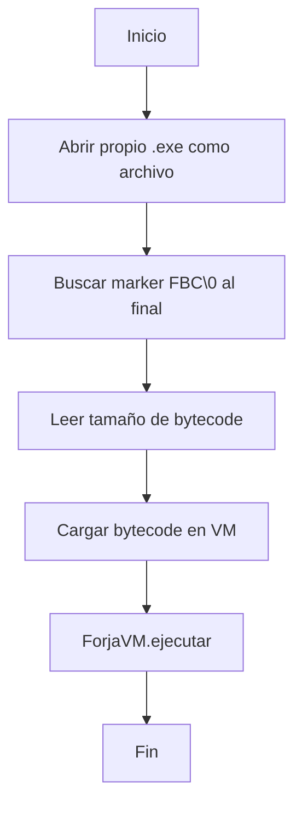
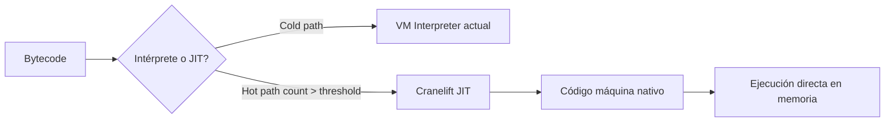
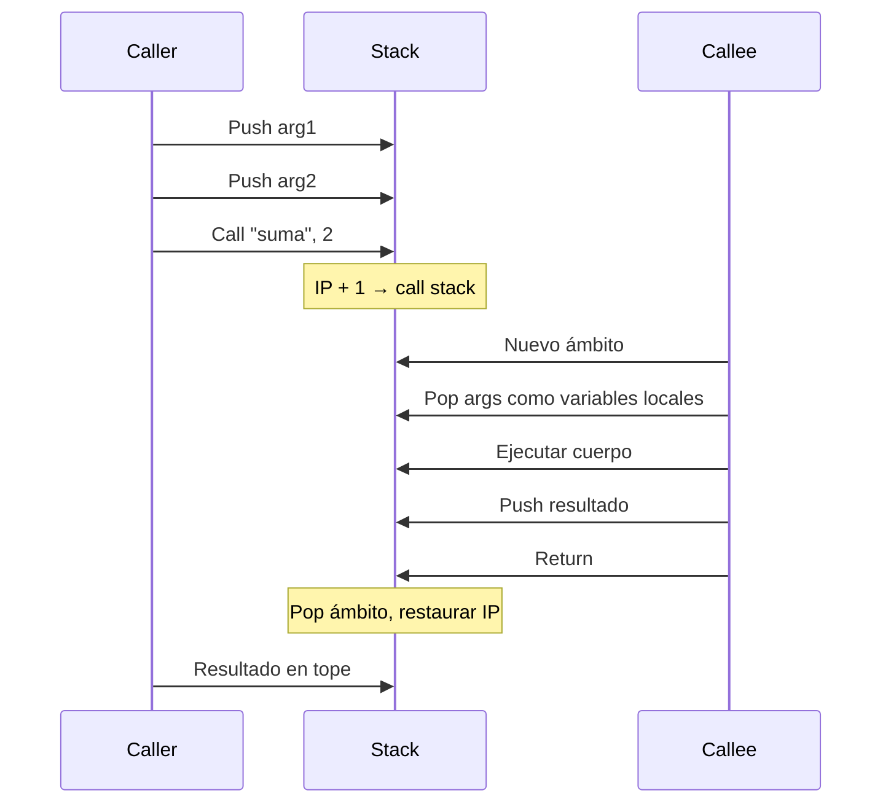

# Roadmap: Forja VM Avanzada

## 4 Grandes Features

---

## Feature A: Runtime Stub Nativo (Single .exe)

### Objetivo
`forja build ejemplo.fa -o programa.exe` genera un **único .exe** autónomo que ejecuta el programa sin scripts ni dependencias.

### Estrategia: Bytecode Append

```mermaid
flowchart LR
    A[forja_runtime.exe] --> B[Compilador AOT]
    C[bytecode.fbc] --> B
    B --> D[programa.exe]
    D --> E[| Runtime VM | Bytecode |]
```

1. Pre-compilamos un **stub** [`forja_runtime.exe`] una sola vez (con `cargo build`)
2. El AOT compiler copia el stub y le **apendiza** el bytecode `.fbc` al final
3. El stub, al ejecutarse, se lee a sí mismo, encuentra el bytecode (busca un magic "FBC\0" al final), lo carga y lo ejecuta

### Diagrama de flujo del stub



### Implementación

```rust
// En src/aot.rs - versión mejorada
pub fn generar_ejecutable(bytecode: &[u8], salida: &str) -> Result<(), String> {
    // 1. Leer el stub precompilado
    let stub = include_bytes!("../runtime/forja_runtime.exe");

    // 2. Escribir stub + bytecode
    let mut output = Vec::new();
    output.extend_from_slice(stub);
    output.extend_from_slice(bytecode);

    // 3. Escribir magic + tamaño al final
    let size = (bytecode.len() as u32).to_le_bytes();
    output.extend_from_slice(&size);
    output.extend_from_slice(b"FBC\0");

    fs::write(salida, &output)?;
    Ok(())
}
```

El stub (`runtime/forja_runtime.exe`) sería un pequeño programa Rust que:
1. Se abre a sí mismo (`std::env::current_exe()`)
2. Lee los últimos 8 bytes para obtener tamaño + magic
3. Busca hacia atrás el bytecode
4. Lo ejecuta con `ForjaVM::new().cargar_bytecode(...).ejecutar()`

### Archivos a modificar
| Archivo | Cambio |
|---|---|
| `src/aot.rs` | Nuevo `generar_ejecutable()` con append |
| `runtime/forja_runtime.rs` | Nuevo: stub mínimo |
| `runtime/Cargo.toml` | Nuevo: compilar stub |
| `Cargo.toml` | Build script que compila el stub |

### Dependencias
**0 dependencias externas.** Solo `std::fs`, `std::env`.

---

## Feature B: JIT con Cranelift

### Objetivo
Reemplazar el loop interpretado de la VM por compilación JIT a código máquina nativo, para hot paths.

### Arquitectura



### Estrategia Híbrida (Interpret + JIT)

1. **Comienzo**: Todos los opcodes se ejecutan en la VM actual (intérprete)
2. **Profile**: Cada opcode/función tiene un contador de ejecución
3. **Threshold**: Cuando un opcode supera N ejecuciones (ej: 50), se pasa a JIT
4. **JIT Compile**: Cranelift traduce el bloque de bytecode a código máquina
5. **Native**: El código nativo se ejecuta directamente (mmap + ejecutable)

### Mapeo Bytecode → Cranelift IR

```rust
impl JITCompiler {
    fn compilar_bloque(&mut self, opcodes: &[Opcode]) -> Result<*const u8, String> {
        let mut builder = FunctionBuilder::new(...);
        let block = builder.create_block();

        for op in opcodes {
            match op {
                Opcode::PushEntero(n) => {
                    // insn = builder.ins().iconst(types::I64, *n);
                    // builder.ins().stack_store(insn, ptr);
                }
                Opcode::Add => {
                    // a = stack_pop(); b = stack_pop();
                    // result = builder.ins().iadd(a, b);
                    // stack_push(result);
                }
                // ...
            }
        }
        // Finalizar y devolver puntero a código nativo
    }
}
```

### Dependencias nuevas

```toml
[dependencies]
cranelift-codegen = "0.107"
cranelift-module = "0.107"
cranelift-native = "0.107"
target-lexicon = "0.12"
```

### Archivos nuevos

| Archivo | Propósito |
|---|---|
| `src/jit.rs` | JIT Compiler: bytecode → código máquina |
| `src/jit_profiler.rs` | Profile: conteo de ejecuciones, thresholds |

### Trade-offs
| Aspecto | Favor | En contra |
|---|---|---|
| Rendimiento | 10-50x más rápido que interpretar | Overhead de compilación JIT |
| Binary size | - | +2-5 MB por Cranelift |
| Complejidad | - | Alta: IR, register allocation |
| Portabilidad | Cranelift genera multi-plataforma | Dependencia pesada |

### Recomendación
Implementar después de Functions + POO. **Prioridad baja** por ahora.

---

## Feature C: POO en VM

### Objetivo
Soportar `clase`, `constructor`, `este`, `nuevo`, y llamadas a métodos en la VM.

### Representación de Objetos en Memoria

```rust
pub enum ValorVM {
    Entero(i64),
    Decimal(f64),
    Texto(String),
    Booleano(bool),
    Nulo,
    Objeto(ObjetoVM),      // 👈 NUEVO
}

pub struct ObjetoVM {
    pub clase: String,
    pub campos: HashMap<String, ValorVM>,
}

// Definición de clase en VM
pub struct ClaseDef {
    pub nombre: String,
    pub campos: Vec<(String, Tipo)>,
    pub metodos: HashMap<String, MetodoDef>,
}

pub struct MetodoDef {
    pub parametros: Vec<String>,
    pub bytecode: Vec<Opcode>,
    pub label: usize,
}
```

### Nuevos Opcodes

```rust
pub enum Opcode {
    // ... existentes ...
    NewObject(String),                      // crear instancia
    SetField(String),                       // this.campo = pop()
    GetField(String),                       // push(this.campo)
    CallMethod(String, String, usize),      // obj.metodo(args)
    PushThis,                                // push referencia a self
}
```

### Flujo de Instanciación

```mermaid
flowchart TD
    A[nuevo Persona args] --> B[NewObject Persona]
    B --> C[Cargar ClaseDef de Persona]
    C --> D[Crear ObjetoVM con campos default]
    D --> E[Push objeto a la pila]
    E --> F[CallMethod "nuevo"]
    F --> G[Ejecutar constructor]
    G --> H[Objeto inicializado en pila]
```

### Archivos a modificar

| Archivo | Cambio |
|---|---|
| `src/vm.rs` | `ValorVM::Objeto`, `ClaseDef`, `MetodoDef` |
| `src/vm.rs` | Ejecución de NewObject, SetField, GetField, CallMethod |
| `src/bytecode.rs` | Nuevos opcodes + generación desde AST de clase |
| `src/ast.rs` | Ya tiene `Declaracion::Clase` |
| `src/parser.rs` | Ya parsea clases correctamente |

### Tests
```
clase Persona { nombre constructor(n) { este.nombre = n } }
variable p = nuevo Persona("Ana")
escribir(p.nombre)  // "Ana"
```

---

## Feature D: Funciones en VM (Call/Return)

### Objetivo
Soportar llamadas a funciones con argumentos, retorno de valores, y ámbitos anidados.

### Estado Actual
- `Call` y `Return` existen como opcodes pero **no están completamente implementados**
- Las funciones no se registran correctamente en la tabla de funciones
- Los argumentos no se pasan correctamente

### Diseño de Llamada a Función



### Implementación

```rust
// En vm.rs - búsqueda de funciones
fn preparar_funciones(&mut self) {
    for (i, op) in self.bytecode.iter().enumerate() {
        if let Opcode::FunctionDef(nombre, nparams) = op {
            // Registrar posición de la función
            self.funciones.insert(nombre.clone(), i + 1);
            // Saltar el cuerpo de la función
        }
    }
}

// Nuevo opcode: FunctionDef marca el inicio de una función
Opcode::FunctionDef(String, usize), // nombre, #params

// Call mejorado
Opcode::Call(nombre, nargs) => {
    // 1. Buscar función
    let label = self.funciones[&nombre];
    // 2. Guardar frame de retorno
    self.call_stack.push(Frame { ip: self.ip });
    // 3. Nuevo ámbito con parámetros
    let mut ambito = HashMap::new();
    for _ in 0..nargs {
        let val = self.stack.pop()?;
        // Los parámetros se nombran en orden inverso
        // La info de nombres de parámetros está en FunctionDef
    }
    self.variables.push(ambito);
    // 4. Saltar al cuerpo
    self.ip = label;
}

// Return mejorado
Opcode::Return => {
    // 1. Si hay valor de retorno, está en el tope de la pila
    // 2. Restaurar IP y ámbito
    let frame = self.call_stack.pop()?;
    self.variables.pop();
    self.ip = frame.ip;
}
```

### Opcodes nuevos/modificados

```rust
Opcode::FunctionDef(String, usize),  // nombre, #params
Opcode::Call(String, usize),         // nombre, nargs (mejorado)
Opcode::Return,                       // mejorado
```

### Archivos a modificar

| Archivo | Cambio |
|---|---|
| `src/vm.rs` | `preparar_funciones()`, Call/Return real |
| `src/bytecode.rs` | Emitir `FunctionDef`, pasar argumentos |
| `src/ast.rs` | Sin cambios (ya soporta funciones) |
| `src/parser.rs` | Sin cambios (ya parsea funciones) |

### Test
```fa
funcion suma(a, b) { retornar a + b }
variable resultado = suma(3, 4)
escribir(resultado)  // 7
```

---

## Orden de Implementación Recomendado


**Justificación:**
1. **Funciones primero** → base para POO (los métodos son funciones)
2. **POO después** → usa funciones + objetos
3. **Runtime Stub** → una vez que VM es completa, empaquetar
4. **JIT al final** → optimización, no funcionalidad

---

## Resumen de Archivos

| Feature | Archivos nuevos | Archivos modificados | Tests nuevos |
|---|---|---|---|
| A: Stub | `runtime/forja_runtime.rs`, `runtime/Cargo.toml` | `src/aot.rs` | 2 |
| B: JIT | `src/jit.rs`, `src/jit_profiler.rs` | `Cargo.toml`, `src/vm.rs` | 5 |
| C: POO | - | `src/vm.rs`, `src/bytecode.rs` | 5 |
| D: Funciones | - | `src/vm.rs`, `src/bytecode.rs` | 4 |

**Total estimado: +16 tests, ~800 líneas de código nuevo**
