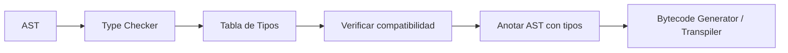
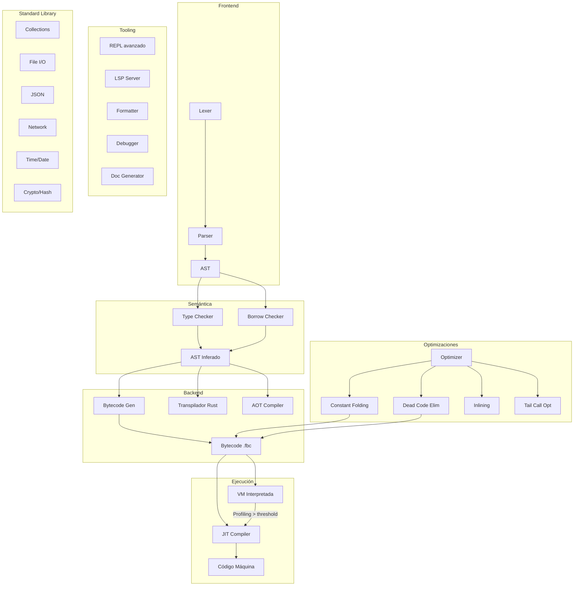

# Forja — Plan para Convertirlo en un Lenguaje Serio y Eficiente

> Análisis exhaustivo de deficiencias vs lenguajes consolidados (Rust, Go, Java, C#, Python).
> Cada ítem incluye: problema actual, impacto, solución propuesta y esfuerzo estimado.

---

## Índice

1. [Sistema de Tipos](#1-sistema-de-tipos)
2. [Máquina Virtual y Performance](#2-máquina-virtual-y-performance)
3. [Memoria y Ownership](#3-memoria-y-ownership)
4. [Módulos y Namespaces](#4-módulos-y-namespaces)
5. [Manejo de Errores](#5-manejo-de-errores)
6. [Concurrencia](#6-concurrencia)
7. [Standard Library](#7-standard-library)
8. [Tooling y DX](#8-tooling-y-dx)
9. [Compilación y Optimizaciones](#9-compilación-y-optimizaciones)
10. [Interoperabilidad](#10-interoperabilidad)
11. [Testing y Calidad](#11-testing-y-calidad)
12. [Roadmap Priorizado](#12-roadmap-priorizado)

---

## 1. Sistema de Tipos

### 1.1 Type checker ausente
**Problema**: [`Tipo`](src/ast.rs:25) está definido pero [`analizar_expresion`](src/semantics.rs:420) retorna `None` para la mayoría de expresiones. No hay verificación de compatibilidad de tipos en operaciones binarias, llamadas a función, o asignaciones.

**Impacto**: `variable x = "texto"; x = x + 5` no da error en tiempo de compilación. El error aparece recién en runtime en la VM.

**Solución**: Implementar un Type Checker completo que recorra el AST, infiera tipos y verifique compatibilidad:
- Entero + Decimal → Decimal ✓ (ya funciona en VM)
- Texto + Entero → debe ser error o coerción explícita
- Llamadas a función deben verificar número y tipo de argumentos

**Arquitectura**:


### 1.2 Tipos compuestos limitados
**Problema**: No hay soporte real para:
- **Arrays**: [`Expresion::Arreglo`](src/ast.rs:108) existe en AST y se parsea, pero no hay `ValorVM::Arreglo` en la VM, ni opcodes `ArrayGet`/`ArraySet`/`ArrayLen`
- **Tuplas**: No existen en el lenguaje
- **Mapas/Diccionarios**: No existen
- **Enums**: [`Tipo::Arreglo`](src/ast.rs:32) está con `#[allow(dead_code)]`
- **Option/Result**: No existen tipos algebraicos

### 1.3 Inferencia de tipos débil
**Problema**: El transpilador [`inferir_tipo_expr`](src/transpiler.rs:132) solo infiere tipos de literales. No hay inferencia全局 (global).

### 1.4 Genéricos ausentes
**Problema**: No hay `clase Par<T>`, `funcion identidad<T>(x: T) -> T`. Todo el código es monomórfico.

### 1.5 Tipos de retorno en funciones
**Problema**: [`Declaracion::Funcion`](src/ast.rs:135) tiene `tipo_retorno: Option<Tipo>` pero no se verifica que el cuerpo retorne el tipo correcto.

---

## 2. Máquina Virtual y Performance

### 2.1 VM puramente interpretada
**Problema**: [`ForjaVM::ejecutar`](src/vm.rs:245) es un loop match-bytecode. Sin optimización alguna:
- Cada operación hace match, pop, push, clone de `ValorVM`
- `ValorVM::Texto(String)` clona cadenas repetidamente
- No hay inline caching para llamadas a método
- No hay constant folding en bytecode

**Benchmark**: Un loop de 1M iteraciones tomaría segundos vs microsegundos en Rust nativo.

### 2.2 JIT inmaduro y no integrado
**Problema**: [`X64JIT`](src/jit.rs:16) solo compila bloques con `PushEntero`, `Add`, `Sub`, `Mul`. No soporta:
- Control de flujo (if, while)
- Llamadas a función
- Strings, objetos, floats
- Solo funciona en Windows (VirtualAlloc)

**Solución**: 
- Integrar profiling: contar ejecuciones de cada bloque en VM
- Threshold de compilación: si un bloque se ejecuta > N veces, JIT-compilarlo
- Cache de código compilado

### 2.3 String interning ausente
**Problema**: En [`ValorVM::Texto(String)`](src/vm.rs:28), cada cadena se clona y almacena por separado. Para strings repetidos (nombres de campo, etc.), hay duplicación masiva.

**Solución**: Implementar `Rc<str>` o un string pool global.

### 2.4 Stack overflow no controlado
**Problema**: La pila [`stack: Vec<ValorVM>`](src/vm.rs:158) puede crecer sin límite. Una función recursiva infinita causa OOM, no un stack overflow controlado.

### 2.5 Garbage collection ausente
**Problema**: [`ObjetoRef(Rc<RefCell<ObjetoVM>>)`](src/vm.rs:15) usa reference counting de Rust. Esto funciona pero:
- No detecta ciclos (memoria leak si objeto A → B → A)
- Overhead de Rc/RefCell en cada acceso

### 2.6 Sin soporte para valores grandes
**Problema**: Todos los valores se almacenan en `enum ValorVM` en la pila. Un string de 1MB vive en la pila de la VM, clonándose en cada operación.

---

## 3. Memoria y Ownership

### 3.1 Borrow checker incompleto
**Problema**: El borrow checker en [`semantics.rs`](src/semantics.rs) implementa:
- ✅ Variables no declaradas
- ✅ Mutabilidad
- ✅ Préstamos básicos (`&x`)
- ⚠️ Moves activados (fix reciente) pero solo para tipos conocidos
- ❌ Lifetime analysis: no hay seguimiento de cuándo termina un préstamo
- ❌ No verifica `&mut` exclusividad
- ❌ No hay borrowing en la VM (solo en transpilador a Rust)

### 3.2 Sin RAII / Drop
**Problema**: No hay concepto de destructores. Los recursos (archivos, conexiones BD) no se cierran automáticamente.

### 3.3 Sin control de memoria explícito
**Problema**: No hay allocators personalizados, ni arena allocation, ni stack allocation.

---

## 4. Módulos y Namespaces

### 4.1 Sin sistema de módulos
**Problema**: Todo el código Forja está en un único archivo. [`Programa`](src/ast.rs:191) es `Vec<Declaracion>` sin ninguna estructura de módulos.

**Impacto**: Proyectos > 1000 líneas son inmanejables. No hay reuso de código entre archivos.

**Solución propuesta**: Sintaxis `importar "math"`, `importar "collections/lista"`:
```fa
importar "math"
importar "io" as entrada_salida

math.sqrt(16)  // → 4
```

### 4.2 Sin visibilidad (público/privado)
**Problema**: Todas las funciones, clases y variables son globales y accesibles desde cualquier parte.

### 4.3 Sin package manager
**Problema**: No hay forma de instalar dependencias de terceros.

---

## 5. Manejo de Errores

### 5.1 Sin try/catch o Result
**Problema**: El único mecanismo de error es `ErrorVM` que termina la ejecución. No hay:
- `try { ... } capturar { ... }`
- Tipo `Resultado<T, Error>`
- Propagación de errores con `?`

**Ejemplo de lo que debería ser posible**:
```fa
funcion dividir(a, b) -> Resultado<Entero, Texto> {
    si (b == 0) {
        retornar Error("No se puede dividir por cero")
    }
    retornar Exito(a / b)
}

variable resultado = dividir(10, 0)?
// Si es Error, el ? propaga automáticamente
```

### 5.2 Stack traces limitados
**Problema**: [`Frame`](src/vm.rs:166) solo guarda `ip_retorno` y nombre. No hay información de línea/columna en el runtime.

### 5.3 Sin pánicos recuperables
**Problema**: DivisionPorCero termina el programa. No hay `capturar` para manejar el error.

---

## 6. Concurrencia

### 6.1 Sin hilos ni async
**Problema**: La VM es single-threaded. No hay:
- `hilo` (thread)
- `async`/`esperar` (await)
- Canales (channels)
- Mutex / locks

### 6.2 Sin async runtime
**Problema**: Incluso con sintaxis async, no hay reactor/event loop.

### 6.3 Sin paralelismo
**Problema**: No hay `para paralelo` ni data parallelism.

---

## 7. Standard Library

Actualmente la stdlib consiste en una sola función: [`escribir()`](src/token.rs:140).

### 7.1 Colecciones faltantes
| Colección | Estado |
|-----------|--------|
| Lista/Array | ⚠️ Solo AST, sin VM |
| Mapa/Diccionario | ❌ |
| Conjunto/Set | ❌ |
| Cola/Queue | ❌ |
| Pila/Stack | ⚠️ Solo la pila interna de VM |

### 7.2 I/O
| Funcionalidad | Estado |
|--------------|--------|
| `escribir()` (stdout) | ✅ |
| `leer()` (stdin) | ❌ |
| Archivos (`abrir`, `leer`, `escribir`) | ❌ |
| Red (HTTP, sockets) | ❌ |
| JSON | ❌ |
| CSV | ❌ |

### 7.3 APIs de String
| API | Estado |
|-----|--------|
| `.length()` | ❌ |
| `.split()` | ❌ |
| `.trim()` | ❌ |
| `.to_upper()` / `.to_lower()` | ❌ |
| `.contains()` | ❌ |
| Interpolación `"Hola {nombre}"` | ❌ |
| `.format()` | ❌ |

### 7.4 APIs de Tiempo
| API | Estado |
|-----|--------|
| `ahora()` / `DateTime` | ❌ |
| `Dormir(ms)` / sleep | ❌ |
| Timer / Ticker | ❌ |

### 7.5 APIs de Sistema
| API | Estado |
|-----|--------|
| Argumentos CLI | ❌ |
| Variables de entorno | ❌ |
| Sistema de archivos | ❌ |
| Procesos | ❌ |
| Señales | ❌ |

### 7.6 APIs de Datos
| API | Estado |
|-----|--------|
| `BD()` → SQLite (declarado en token pero no implementado) | ❌ |
| `BD("sqlite:memoria")` en transpiler.rs es un TODO | ❌ |
| JSON parser | ❌ |
| Random | ❌ |
| Hashing / Cripto | ❌ |

---

## 8. Tooling y DX

### 8.1 REPL mínimo
**Problema**: [`REPL`](src/repl.rs:8) es funcional pero:
- Sin historial de comandos
- Sin autocompletado
- Sin edición multilínea
- [`mostrar_variables()`](src/repl.rs:93) es un stub

### 8.2 Sin Language Server (LSP)
**Problema**: No hay autocompletado, go-to-definition, hover info, diagnosticos en tiempo real en el editor.

### 8.3 Sin formateador de código
**Problema**: No hay `forja fmt`. El estilo de código es manual.

### 8.4 Sin linter
**Problema**: No hay `forja lint` para detectar:

### 8.5 Sin debugger
**Problema**: No hay `forja debug` para:
- Step-through de código Forja
- Inspección de variables en runtime
- Breakpoints
- Watch expressions

### 8.6 Sin documentación de API
**Problema**: No hay `forja doc` para generar documentación HTML desde comentarios.

### 8.7 Sin benchmark
**Problema**: No hay `forja bench` para medir performance.

---

## 9. Compilación y Optimizaciones

### 9.1 Sin constant folding
**Problema**: `2 + 3` se ejecuta como PushEntero(2), PushEntero(3), Add en la VM. Debería ser PushEntero(5) directamente.

**Solución**: Pase de optimización en bytecode que pliegue constantes.

### 9.2 Sin dead code elimination
**Problema**: Variables declaradas y nunca leídas. Funciones definidas y nunca llamadas. Todo se compila igual.

### 9.3 Sin inline expansion
**Problema**: Llamadas a funciones pequeñas (getters, setters) tienen overhead de call/return en la VM.

### 9.4 Sin tail call optimization
**Problema**: Llamadas recursivas al final de una función llenan el call stack.

### 9.5 Sin loop unrolling
**Problema**: `repetir (3) { ... }` se ejecuta con 3 iteraciones de jump. Podría duplicar el cuerpo 3 veces.

### 9.6 Sin escape analysis
**Problema**: Objetos temporales (ej: resultado de suma de strings) se crean en heap aunque podrían estar en stack.

### 9.7 Sin compilación incremental
**Problema**: Cada `cargo build` recompila todo desde cero.

### 9.8 AOT compiler básico
**Problema**: [`AOTCompiler`](src/aot.rs:11) solo incrusta bytecode al final del .exe. No genera código nativo. El programa depende de la VM interpretada.

---

## 10. Interoperabilidad

### 10.1 Sin FFI
**Problema**: No hay forma de llamar código C/Rust desde Forja.

**Solución**: Declaraciones como:
```fa
externo funcion printf(formato: Texto, ...) -> Entero
```

### 10.2 Sin ABI estable
**Problema**: No hay una Application Binary Interface definida. El formato `.fbc` es interno y puede cambiar.

### 10.3 Sin WASM target
**Problema**: No se puede compilar Forja a WebAssembly para correr en el navegador.

---

## 11. Testing y Calidad

### 11.1 Coverage bajo
**Problema**: 78 tests para ~4800 líneas = ~1.6%. Muchas funciones sin tests:
| Módulo | Tests | Cobertura aprox |
|--------|-------|-----------------|
| lexer.rs | 10 | ✅ buena |
| parser.rs | 11 | ✅ buena |
| semantics.rs | 9 | ⚠️ media |
| transpiler.rs | 11 | ⚠️ media |
| bytecode.rs | 7 | ⚠️ media |
| vm.rs | 9 | ⚠️ media |
| jit.rs | 4 | ⚠️ baja |
| repl.rs | 0 | ❌ |
| aot.rs | 0 | ❌ |
| selfrun.rs | 0 | ❌ |
| error.rs | 0 | ❌ |

### 11.2 Sin tests de regresión
**Problema**: No hay CI/CD que ejecute tests automáticamente.

### 11.3 Sin fuzzing
**Problema**: No hay generación aleatoria de código Forja para encontrar bugs.

### 11.4 Sin property-based testing
**Problema**: No hay tests como "para toda x, x + 0 == x".

---

## 12. Roadmap Priorizado

### Fase 0 — Fundación (4-6 semanas)
```
Prioridad más alta: lo que define que Forja sea usable para algo real
```

| # | Tarea | Dependencias |
|---|-------|-------------|
| P0.1 | **Type checker completo**: inferir tipos de todas las expresiones, verificar compatibilidad en operaciones binarias y llamadas | Ninguna |
| P0.2 | **Arrays en VM**: `ValorVM::Arreglo`, opcodes `ArrayNew`, `ArrayGet`, `ArraySet`, `ArrayLen` | P0.1 |
| P0.3 | **Sistema de módulos**: `importar "modulo"`, búsqueda en rutas, múltiples archivos | Ninguna |
| P0.4 | **Strings**: API básica (`.length()`, `.split()`, `.contains()`), interpolación `"Hola {x}"` | P0.1 |
| P0.5 | **Manejo de errores**: `Resultado<T,E>`, `try`/`capturar`, propagación con `?` | P0.1 |

### Fase 1 — Usabilidad (4-6 semanas)
```
Para que un desarrollador pueda elegir Forja sobre Python/Rust
```

| # | Tarea | Dependencias |
|---|-------|-------------|
| P1.1 | **Standard Library**: colecciones (Lista, Mapa, Conjunto), I/O archivos, JSON, Random | P0.1, P0.3 |
| P1.2 | **REPL mejorado**: historial (`rustyline`), autocompletado, edición multilínea, `mostrar_variables()` real | Ninguna |
| P1.3 | **LSP básico**: autocompletado, errores en tiempo real | P0.1 |
| P1.4 | **CI/CD**: GitHub Actions con `cargo test --lib`, `cargo build` | Ninguna |
| P1.5 | **Formateador**: `forja fmt` | P0.1 |
| P1.6 | **CLI mejorado**: `forja init`, `forja new`, colores, progreso | Ninguna |

### Fase 2 — Performance (4-8 semanas)
```
Para que sea eficiente
```

| # | Tarea | Dependencias |
|---|-------|-------------|
| P2.1 | **Constant folding** en bytecode | Ninguna |
| P2.2 | **String interning**: `Rc<str>`, string pool | Ninguna |
| P2.3 | **VM optimizada**: inline caching para métodos, mejor dispatch, menos clones | Ninguna |
| P2.4 | **JIT funcional**: profiling + threshold + compilación de bloques calientes en x64 y ARM64 | Ninguna |
| P2.5 | **Dead code elimination**: vars no leídas, funciones no llamadas | P0.1 |
| P2.6 | **Ahead-of-Time real**: compilar Forja a código nativo (sin VM), usando Cranelift o LLVM | Ninguna |

### Fase 3 — Madurez (8-12 semanas)
```
Para competir con lenguajes establecidos
```

| # | Tarea | Dependencias |
|---|-------|-------------|
| P3.1 | **Concurrencia**: hilos (OS threads), canales, Mutex | P0.1 |
| P3.2 | **Async/Await**: runtime async, event loop, I/O no bloqueante | P3.1 |
| P3.3 | **Enums y Pattern Matching**: `tipo Opcion = Algo \| Nada` con `coincidir` | P0.1 |
| P3.4 | **Genéricos**: `clase Par<T>`, `funcion id<T>(x: T) -> T` | P0.1 |
| P3.5 | **FFI**: llamar C desde Forja, ABI estable | Ninguna |
| P3.6 | **Closures**: funciones anónimas con captura de entorno | P0.1 |
| P3.7 | **Debugger**: step-through, breakpoints, watch | P0.1 |
| P3.8 | **WASM backend**: compilar Forja a WebAssembly | Ninguna |

### Fase 4 — Ecosistema (ongoing)
```
Para tener una comunidad
```

| # | Tarea |
|---|-------|
| P4.1 | Package manager: `forja install`, registro de paquetes |
| P4.2 | Documentación: `forja doc`, docs.forja-lang.org |
| P4.3 | Playground web: probar Forja en el navegador |
| P4.4 | Extensiones VS Code, IntelliJ, Vim/Neovim |
| P4.5 | Benchmarks vs Python, Lua, JavaScript, Rust |
| P4.6 | Website oficial, tutoriales, ejemplos |

---

## Diagrama de Arquitectura Propuesta (Estado Final)



---

## Conclusión

Forja tiene una base técnica sólida (lexer, parser, AST, bytecode, VM) pero está en estado **prototipo educativo**. Para ser un lenguaje serio necesita:

| Aspecto | Estado actual | Objetivo |
|---------|--------------|----------|
| Type safety | ❌ Sin type checker | ✅ Type checker completo |
| Performance | ❌ VM interpretada pura | ✅ JIT + optimizaciones |
| Stdlib | ❌ Solo `escribir()` | ✅ Colecciones, I/O, JSON, Red |
| Módulos | ❌ Un solo archivo | ✅ `importar`, namespaces |
| Errores | ❌ Runtime fatal | ✅ Result<T,E>, try/catch |
| Concurrencia | ❌ Single-thread | ✅ Hilos, async/await |
| Tooling | ❌ REPL mínimo | ✅ LSP, formatter, debugger |
| Testing | ⚠️ 78 tests (1.6% coverage) | ✅ >500 tests, CI/CD |
| Dependencias muertas | ⚠️ Cranelift (6 crates) sin usar | ✅ Limpiar |
| Transpilador | ⚠️ Genera Rust con errores de tipos | ✅ Rust válido y optimizado |
