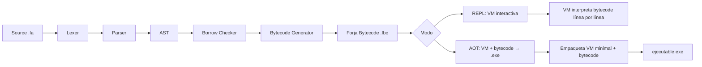
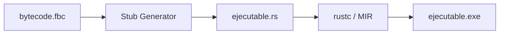
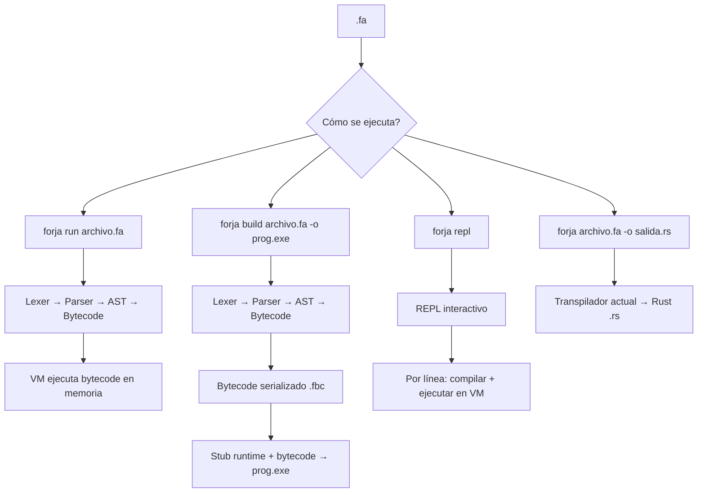

# Arquitectura: Forja VM + AOT Compiler

## Objetivo

Un compilador **Forja (fa)** que produzca ejecutables nativos **sin depender de Rust, GCC, linkers ni nada externo**. Todo debe ser autónomo.

---

## 1. Análisis de Opciones

| Opción | Pros | Contras | Recomendación |
|---|---|---|---|
| **Bytecode VM + AOT** | Sin dependencias externas, ejecutable único, rápido de implementar, multiplataforma | VM overhead, no es código máquina nativo | ✅ **Elegida** |
| **JIT con Cranelift** | Código nativo en tiempo real, rápido | Complejidad, dependencia de crate Cranelift (250KB+), mayor binary | ⏳ Futuro |
| **Transpilar a C + GCC embebido** | Código nativo, GCC optimiza | Necesita GCC instalado (dependencia externa) | ❌ Descartada |
| **LLVM IR + LLVM backend** | Código nativo optimizado | Dependencia de LLVM (instalación externa), enorme complejidad | ❌ Descartada |
| **x86-64 directo (sin VM)** | Máximo rendimiento | Inmensa complejidad, frágil, solo una arquitectura | ❌ Descartada |

### Decisión: **Bytecode VM + AOT Compiler Stack-Based**

---

## 2. Arquitectura General



### Componentes nuevos (a implementar)

| Módulo | Archivo | Propósito |
|---|---|---|
| Bytecode Generator | [`src/bytecode.rs`](src/bytecode.rs) | AST → bytecode serializable |
| Forja VM | [`src/vm.rs`](src/vm.rs) | Intérprete de bytecode stack-based |
| AOT Packager | [`src/aot.rs`](src/aot.rs) | VM + bytecode → ejecutable único |
| REPL | [`src/repl.rs`](src/repl.rs) | Intérprete interactivo |
| CLI extendido | [`src/main.rs`](src/main.rs) | Modos: run, build, repl |

---

## 3. Forja Bytecode (Formato .fbc)

### 3.1 Arquitectura del Bytecode

**Stack-based VM**: Todas las operaciones trabajan sobre una pila de valores.

### 3.2 Definición de Opcodes

```rust
pub enum Opcode {
    // === Gestión de pila ===
    PushI64(i64),       // Push entero
    PushF64(f64),       // Push decimal
    PushString(String), // Push string
    PushBool(bool),     // Push booleano
    PushNull,           // Push nulo
    Pop,                // Pop y descartar
    Dup,                // Duplicar tope de pila

    // === Variables ===
    Load(String),       // Cargar variable a la pila
    Store(String),      // Pop valor, guardar en variable
    LoadRef(String),    // Cargar referencia de variable
    Declare(String), bool // Declarar variable (nombre, mutable)

    // === Aritméticas ===
    Add, Sub, Mul, Div, // Pop dos, push resultado

    // === Comparaciones ===
    Eq, Neq, Lt, Gt, Le, Ge, // Pop dos, push bool

    // === Lógicas ===
    And, Or, Not,       // Operaciones booleanas

    // === Control de flujo ===
    Jump(usize),        // Salto incondicional
    JumpIfFalse(usize), // Pop bool, saltar si falso
    Halt,               // Fin de programa

    // === Funciones ===
    Call(String, usize),        // Llamar función (nombre, #args)
    Return,                     // Retornar de función
    CallMethod(String, String), // objeto.método

    // === POO ===
    NewObject(String),          // Crear instancia de clase
    SetField(String),           // this.campo = valor
    GetField(String),           // valor = this.campo

    // === I/O ===
    Print,                      // Pop valor, escribir stdout

    // === Meta ===
    Label(usize),              // Marcador de posición (para saltos)
    Nop,                       // No operación
}
```

### 3.3 Serialización Binaria

El bytecode se serializa en un formato binario compacto:

```
┌──────────────────────────────────────────┐
│ Magic: "FBC\0" (4 bytes)                │
│ Version: u32 (4 bytes)                  │
│ String Pool Size: u32 (4 bytes)         │
│ String Pool: [u8; N] (strings UTF-8)    │
│ Opcodes Count: u32 (4 bytes)            │
│ Opcodes: [Opcode; N] (secuencia)        │
└──────────────────────────────────────────┘
```

Cada opcode se codifica como:
- **1 byte**: tipo de opcode (0-255)
- **0-N bytes**: payload (según el tipo: i64, f64, string index, usize, etc.)

---

## 4. Forja VM (Intérprete)

### 4.1 Estructura

```rust
pub struct ForjaVM {
    ip: usize,                      // Instruction Pointer
    stack: Vec<Valor>,              // Pila de datos
    frames: Vec<Frame>,             // Pila de llamadas
    variables: Vec<HashMap<String, Valor>>, // Ámbitos de variables
    clases: HashMap<String, ClaseInfo>,     // Definiciones de clases
    bytecode: Vec<Opcode>,          // Código a ejecutar
    strings: Vec<String>,           // String pool
    output: String,                 // Captura de output
}

pub enum Valor {
    Entero(i64),
    Decimal(f64),
    Texto(String),
    Booleano(bool),
    Nulo,
    Objeto(HashMap<String, Valor>),
    Referencia(usize, String),  // (scope, nombre) para &var
}

struct Frame {
    ip_retorno: usize,        // Dónde volver después de return
    nombre_funcion: String,
}
```

### 4.2 Ciclo de Ejecución

```rust
impl ForjaVM {
    pub fn ejecutar(&mut self) -> Result<(), ErrorVM> {
        loop {
            let opcode = &self.bytecode[self.ip];
            self.ip += 1;
            match opcode {
                Opcode::PushI64(n) => self.stack.push(Valor::Entero(*n)),
                Opcode::Add => {
                    let b = self.stack.pop()?;
                    let a = self.stack.pop()?;
                    self.stack.push(a.sumar(&b)?);
                }
                Opcode::Jump(target) => self.ip = *target,
                Opcode::JumpIfFalse(target) => {
                    if !self.stack.pop()?.es_verdadero() {
                        self.ip = *target;
                    }
                }
                Opcode::Halt => break,
                Opcode::Print => {
                    let val = self.stack.pop()?;
                    println!("{}", val);
                }
                // ... resto de opcodes
            }
        }
        Ok(())
    }
}
```

### 4.3 Manejo de Errores en Runtime

```rust
pub enum ErrorVM {
    StackUnderflow(String),    // Pop en pila vacía
    VariableNoDeclarada(String),
    TipoIncompatible(String),
    DivisionPorCero,
    FuncionNoDefinida(String),
    IndiceFueraDeRango(usize),
}

impl ErrorVM {
    pub fn to_json(&self) -> String {
        // Formato JSON consistente con el compilador
    }
}
```

---

## 5. AOT Compiler (Generación de Ejecutable)

### 5.1 Concepto

El AOT Compiler genera un **ejecutable autónomo** que contiene:
1. El bytecode Forja compilado (`.fbc`)
2. Un runtime mínimo (la VM), escrito en Rust, compilado a un pequeño stub

### 5.2 Estrategia



**Pero** el objetivo es **no depender de rustc**. Entonces:

### 5.3 Solución: Stub precompilado + bytecode incrustado

En lugar de compilar en cada build, distribuimos:

1. **Un stub precompilado** [`forja_runtime.o`](forja_runtime.o) — es la VM compilada una sola vez con `rustc`
2. **El bytecode** se incrusta en el stub como datos
3. Un simple **linker script** o copia de bytes genera el ejecutable final

```
┌──────────────────────────┐
│   forja_runtime.exe      │  ← Stub precompilado (200KB)
│   (VM sin bytecode)      │
├──────────────────────────┤
│   bytecode.fbc           │  ← Datos incrustados al final
│   (código Forja)         │
└──────────────────────────┘
```

**¿Cómo funciona?**
- El stub se linkea con una sección de datos variable
- El stub lee su propio archivo `bytecode.fbc` desde el final del .exe
- El usuario final solo ve un `.exe` que ejecuta el programa Forja

### 5.4 Alternativa (más simple): Wrapper batch

Para la primera versión, un script batch que haga:
```batch
@echo off
forja.exe "%~dpn0.fbc" %*
```

O incluso más simple: el ejecutable `forja run programa.fa` funciona como intérprete, y `forja build programa.fa` crea un batch que lo ejecuta.

**Pero el usuario quiere UN solo .exe**. Entonces la opción 5.3 es la correcta.

---

## 6. REPL Interactivo

### 6.1 Experiencia

```
$ forja repl
Forja v0.1.0 — Escribí 'salir' para terminar
> variable x = 5
> x = x + 10
> escribir(x)
15
> constante nombre = "Gaucho"
> escribir("Hola " + nombre)
Hola Gaucho
> salir
```

### 6.2 Implementación

```rust
pub struct REPL {
    vm: ForjaVM,
    buffer: String,
    historial: Vec<String>,
}

impl REPL {
    pub fn iniciar(&mut self) {
        loop {
            let input = self.leer_linea("> ");
            if input == "salir" { break; }
            // Compilar línea → bytecode
            let bytecode = self.compilar_linea(&input);
            // Ejecutar en VM
            self.vm.cargar_bytecode(bytecode);
            self.vm.ejecutar();
        }
    }
}
```

El REPL mantiene el estado de la VM entre líneas, así que las variables declaradas persisten.

---

## 7. Pipeline Completo (Estado Final)



---

## 8. Plan de Implementación (Fases)

### FASE VM-1: Bytecode Generator
- Implementar [`Opcode`](src/bytecode.rs) enum y serialización
- Recorrer AST y emitir opcodes
- Soporte inicial: variables, aritmética, print, condicionales, bucles

### FASE VM-2: Forja VM
- Implementar [`ForjaVM`](src/vm.rs) con ciclo de ejecución
- Pila de datos, ámbitos de variables
- Manejo de errores en runtime
- Pruebas: ejecutar bytecode y verificar resultados

### FASE VM-3: Integración en CLI
- `forja run archivo.fa`: compila y ejecuta en VM
- `forja repl`: modo interactivo
- Reemplazar la dependencia de Rust para ejecución directa

### FASE VM-4: AOT Compiler
- Generar stub con runtime precompilado
- Incrustar bytecode en el stub
- `forja build archivo.fa -o prog.exe`: genera ejecutable autónomo

### FASE VM-5 (Futuro): JIT con Cranelift
- Evaluar si vale la pena el overhead de Cranelift
- Reemplazar el loop interpretado por compilación JIT a código máquina
- Rendimiento cercano a Rust nativo

---

## 9. Dependencias

Para la VM base: **0 dependencias externas** (solo std de Rust).
Para AOT: **0 dependencias** (manipulación de archivos binarios).
Para JIT (futuro): `cranelift-codegen` (crate Rust).

---

## 10. Criterios de Éxito

1. [ ] `forja run examples/hola_mundo.fa` imprime "Hola, mundo desde Forja!" sin usar Rust
2. [ ] `forja repl` permite escribir código y ver resultados inmediatos
3. [ ] `forja build examples/hola_mundo.fa -o hola.exe` genera un .exe autónomo
4. [ ] El .exe generado funciona en otra PC sin Rust instalado
5. [ ] 100% de los ejemplos actuales funcionan en la VM
6. [ ] Los errores en runtime se muestran en formato JSON con diagnóstico
