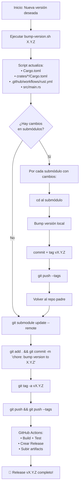

# Estrategia de Gestión de Versiones — Forja (fa)

## 📋 Diagnóstico Actual

### Archivos con versiones hardcodeadas que deben actualizarse manualmente

| Archivo | Versión actual | Propósito |
|---------|---------------|-----------|
| [`Cargo.toml`](Cargo.toml:3) | `0.8.8` | Versión principal del compilador |
| [`crates/forja-rt/Cargo.toml`](crates/forja-rt/Cargo.toml:3) | `0.8.8` | Runtime autónomo |
| [`crates/forja-wasm/Cargo.toml`](crates/forja-wasm/Cargo.toml:3) | `0.8.8` | Bindings WASM |
| [`crates/forja-android-rt/Cargo.toml`](crates/forja-android-rt/Cargo.toml:3) | `0.8.8` | Runtime Android |
| [`crates/forja-gui-rt/Cargo.toml`](crates/forja-gui-rt/Cargo.toml:3) | `0.1.0` | Runtime GUI |
| [`crates/forja-wasm-gui/Cargo.toml`](crates/forja-wasm-gui/Cargo.toml:3) | `0.1.0` | GUI WASM |
| [`.github/workflows/rust.yml`](.github/workflows/rust.yml:268) | `v0.8.8` | Tag de release automática |
| [`src/main.rs`](src/main.rs:1838) | `0.8.8` | Template de nuevo proyecto |
| [`src/main.rs`](src/main.rs:1863) | `0.8.8` | Template de init |

### Submódulos (11 repos independientes)

| Submódulo | Ruta | URL |
|-----------|------|-----|
| vscode | `vscode/` | `github.com/forja-lang/vscode.git` |
| examples | `examples/` | `github.com/forja-lang/examples.git` |
| benchmarks | `benchmarks/` | `github.com/forja-lang/benchmarks.git` |
| docs | `docs/` | `github.com/forja-lang/docs.git` |
| forja-gui-rt | `crates/forja-gui-rt/` | `github.com/forja-lang/forja-gui-rt.git` |
| forja-wasm | `crates/forja-wasm/` | `github.com/forja-lang/forja-wasm.git` |
| forja-stdlib-std | `stdlib/std/` | `github.com/forja-lang/forja-stdlib-std.git` |
| forja-stdlib-gui | `stdlib/gui/` | `github.com/forja-lang/forja-stdlib-gui.git` |
| forja-rt | `crates/forja-rt/` | `github.com/forja-lang/forja-rt.git` |
| forja-android-rt | `crates/forja-android-rt/` | `github.com/forja-lang/forja-android-rt.git` |
| forja-wasm-gui | `crates/forja-wasm-gui/` | `github.com/forja-lang/forja-wasm-gui.git` |

---

## 🏗️ Arquitectura Propuesta: Versionado Semántico + Automatización Gradual

```
┌─────────────────────────────────────────────────────────────────┐
│                    ESTRATEGIA DE VERSIONADO                      │
├─────────────────────────────────────────────────────────────────┤
│                                                                  │
│  ┌──────────────┐    ┌─────────────────┐    ┌────────────────┐  │
│  │  Paso 1:      │    │  Paso 2:         │    │  Paso 3:       │  │
│  │  Unificar      │───▶│  Automatizar      │───▶│  Submodulos   │  │
│  │  versiones     │    │  release local    │    │  sincronizados│  │
│  └──────────────┘    └─────────────────┘    └────────────────┘  │
│                                                                  │
└─────────────────────────────────────────────────────────────────┘
```

### Principios rectores

1. **SemVer estricto** — `MAJOR.MINOR.PATCH` para el compilador
2. **Un solo punto de verdad** — La versión se define en `Cargo.toml` raíz
3. **Submodulos con versionado independiente** — Cada submodulo tiene su propia versión SemVer, pero se etiquetan coordinadamente
4. **CI/CD automatizado** — El pipeline de GitHub Actions detecta la versión y crea tags automáticamente

---

## 📝 Plan de Acción Detallado

### Fase 1: Script de actualización de versión local

Crear [`scripts/bump-version.sh`](scripts/) (o `.ps1` para Windows) que automatice el cambio de versión en todos los archivos locales.

#### Archivos a modificar al subir de versión:

1. **`Cargo.toml`** — `version = "X.Y.Z"` (fuente de verdad)
2. **`crates/forja-rt/Cargo.toml`** — `version = "X.Y.Z"`
3. **`crates/forja-wasm/Cargo.toml`** — `version = "X.Y.Z"`
4. **`crates/forja-android-rt/Cargo.toml`** — `version = "X.Y.Z"`
5. ~~`crates/forja-gui-rt/Cargo.toml`~~ — mantener `0.1.0` hasta que madure (o sincronizar si aplica)
6. ~~`crates/forja-wasm-gui/Cargo.toml`~~ — mantener `0.1.0` hasta que madure
7. **`.github/workflows/rust.yml`** — la línea `tag_name: vX.Y.Z` y `name: vX.Y.Z`
8. **`src/main.rs`** — líneas 1838 y 1863 (templates de proyecto nuevo)

#### Estrategia para los GUI crates

Los crates `forja-gui-rt` y `forja-wasm-gui` están en `0.1.0` porque son más nuevos/inmaduros. Propuesta:
- **No sincronizarlos** con la versión del compilador
- Mantener su propio versionado independiente
- El script **solo actualiza** los que comparten versión con el root

#### Flujo del script:

```bash
# Modo de uso
./scripts/bump-version.sh 0.8.9     # sube a 0.8.9
./scripts/bump-version.sh 0.9.0     # sube a 0.9.0
./scripts/bump-version.sh 1.0.0     # sube a 1.0.0
```

#### Implementación:

```bash
#!/bin/bash
# scripts/bump-version.sh
set -euo pipefail

OLD_VERSION=$(grep '^version' Cargo.toml | head -1 | cut -d'"' -f2)
NEW_VERSION=$1

echo "🔄 Actualizando versión: $OLD_VERSION → $NEW_VERSION"

# 1. Cargo.toml raíz
sed -i "s/^version = \"$OLD_VERSION\"/version = \"$NEW_VERSION\"/" Cargo.toml

# 2. Workspace crates que comparten versión
for crate in forja-rt forja-wasm forja-android-rt; do
    sed -i "s/^version = \"$OLD_VERSION\"/version = \"$NEW_VERSION\"/" "crates/$crate/Cargo.toml"
done

# 3. CI workflow (tag_name y name)
sed -i "s/tag_name: v$OLD_VERSION/tag_name: v$NEW_VERSION/" .github/workflows/rust.yml
sed -i "s/name: v$OLD_VERSION/name: v$NEW_VERSION/" .github/workflows/rust.yml

# 4. src/main.rs templates
sed -i "s/version = \"$OLD_VERSION\"/version = \"$NEW_VERSION\"/" src/main.rs

echo "✅ Versión actualizada a $NEW_VERSION"
echo ""
echo "📋 Archivos modificados:"
echo "   - Cargo.toml"
echo "   - crates/forja-rt/Cargo.toml"
echo "   - crates/forja-wasm/Cargo.toml"
echo "   - crates/forja-android-rt/Cargo.toml"
echo "   - .github/workflows/rust.yml"
echo "   - src/main.rs"
echo ""
echo "⚠️  Próximos pasos manuales:"
echo "   1. Verificar cambios con 'git diff'"
echo "   2. Hacer commit: git commit -m 'chore: bump version to $NEW_VERSION'"
echo "   3. Crear tag: git tag -a v$NEW_VERSION -m 'Release v$NEW_VERSION'"
echo "   4. Push: git push && git push --tags"
```

---

### Fase 2: Coordinación con submódulos

Los submódulos son **repos independientes**. No puedes "bump version" en ellos desde el repo padre directamente porque cada uno tiene su propio historial y releases.

#### Estrategia recomendada:

```
┌──────────────────────────────────────────────────────────────────┐
│                 CICLO DE RELEASE COORDINADO                       │
├──────────────────────────────────────────────────────────────────┤
│                                                                   │
│  Semana 1:  Preparación                                           │
│  ├── Identificar cambios en cada submódulo                        │
│  └── Decidir qué submódulos necesitan release                     │
│                                                                   │
│  Semana 2:  Submódulos (paralelo)                                 │
│  ├── Hacer release de cada submódulo (tag vX.Y.Z)                 │
│  └── Cada submódulo tiene su propio CHANGELOG                     │
│                                                                   │
│  Semana 3:  Repo principal                                        │
│  ├── git submodule update --remote (traer últimos tags)           │
│  ├── Verificar compatibilidad                                     │
│  ├── Bump version con bump-version.sh                             │
│  ├── git commit + tag + push                                      │
│  └── CI/CD genera release automático                              │
│                                                                   │
└──────────────────────────────────────────────────────────────────┘
```

#### Check-list para release de submódulos:

Para cada submódulo que tenga cambios, se debe:
1. Ir a su directorio: `cd crates/forja-wasm`
2. Hacer bump de versión local (cada submódulo tiene su propio `Cargo.toml`)
3. Commit + tag: `git tag -a vX.Y.Z -m "Release vX.Y.Z"`
4. Push: `git push && git push --tags`
5. Crear GitHub Release (opcional, puede ser manual o CI)

#### Simplificación: Releases solo cuando hay cambios

No todos los submódulos necesitan release en cada ciclo. Usar esta matriz:

| Submódulo | ¿Requiere release? | Frecuencia típica |
|-----------|-------------------|-------------------|
| `vscode` | Solo si cambia | Baja |
| `examples` | Solo si cambia | Baja |
| `benchmarks` | Solo si cambia | Baja |
| `docs` | Solo si cambia | Baja |
| `stdlib/std` | Casi siempre | Alta |
| `stdlib/gui` | Solo si cambia | Media |
| `forja-rt` | Casi siempre | Alta |
| `forja-wasm` | Casi siempre | Alta |
| `forja-android-rt` | Solo si cambia | Media |
| `forja-gui-rt` | Solo si cambia | Media |
| `forja-wasm-gui` | Solo si cambia | Media |

---

### Fase 3: Automatización en CI/CD

Modificar [`.github/workflows/rust.yml`](.github/workflows/rust.yml) para que:

1. **Detecte la versión automáticamente** desde `Cargo.toml` (ya lo hace en la línea 231)
2. **Cree el tag automáticamente** si no existe (hoy está hardcodeado en la línea 268)
3. **Genere release notes** automáticas desde Conventional Commits

```yaml
# Cambio propuesto en la sección "Create Release"
- name: Create Release
  uses: softprops/action-gh-release@v3
  with:
    token: ${{ secrets.GITHUB_TOKEN }}
    tag_name: v${{ env.VERSION }}    # ← Dinámico, no hardcodeado
    name: v${{ env.VERSION }}         # ← Dinámico, no hardcodeado
    generate_release_notes: true
    files: binaries/*
```

---

### Fase 4: CHANGELOG y Conventional Commits

Adoptar **Conventional Commits** para generar changelogs automáticos:

```
feat: nueva palabra clave 'iterar'
fix: corregir memory leak en VM
chore: bump version to 0.8.9
docs: actualizar README con nuevos ejemplos
refactor: reorganizar módulo de bytecode
```

Beneficios:
- `generate_release_notes: true` en GitHub Actions produce notas automáticas
- Se puede agregar [`git-cliff`](https://git-cliff.org) para generar CHANGELOG.md local

---

## 📊 Diagrama de Flujo Completo



---

## ✅ Resumen de Tareas para Implementar

### Inmediatas (configuración única):
1. Crear script [`bump-version.sh`](scripts/bump-version.sh) (y su versión PowerShell para Windows)
2. Deshardcodear el tag en [`.github/workflows/rust.yml`](.github/workflows/rust.yml) línea 268-269
3. Agregar [`CHANGELOG.md`](CHANGELOG.md) al repo raíz

### Por release:
4. Ejecutar `bump-version.sh` con la nueva versión
5. Actualizar submódulos que tengan cambios (cada uno con su propio bump)
6. Commit, tag y push

### A futuro (opcional):
7. Considerar [`cargo-release`](https://github.com/crate-ci/cargo-release) para automatizar aún más
8. Considerar [`git-cliff`](https://git-cliff.org) para changelogs automáticos
