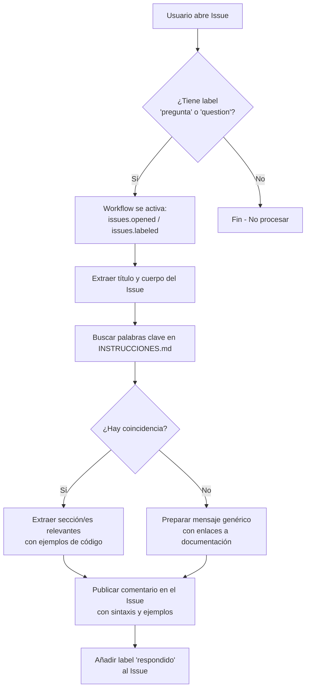
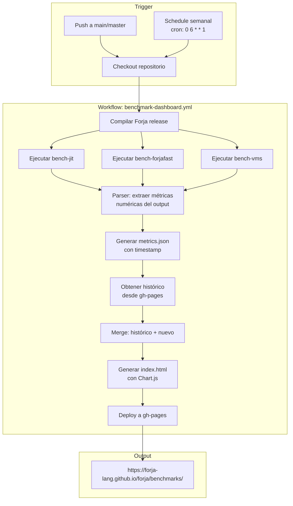
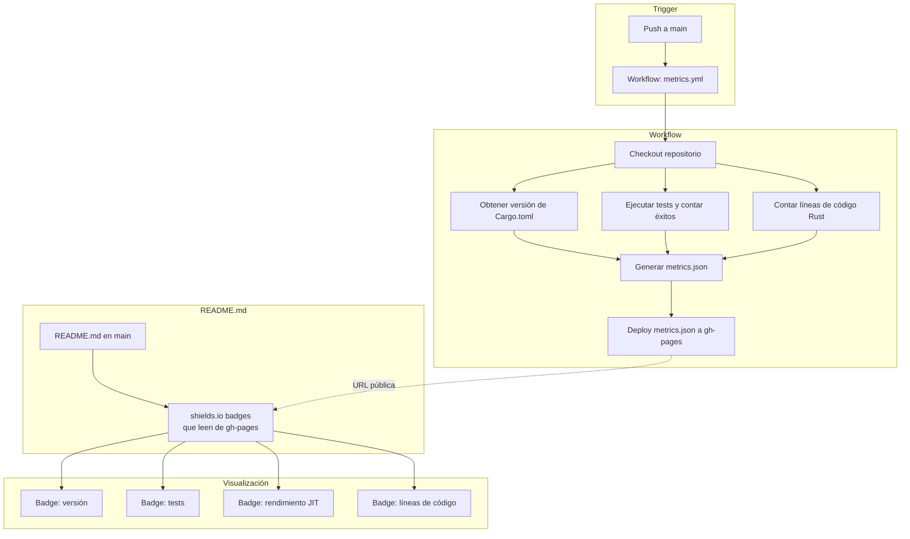
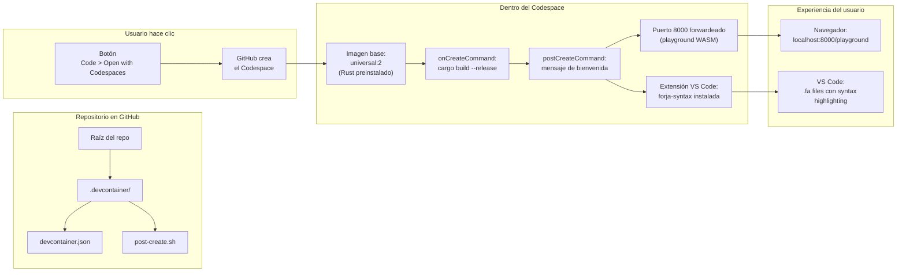
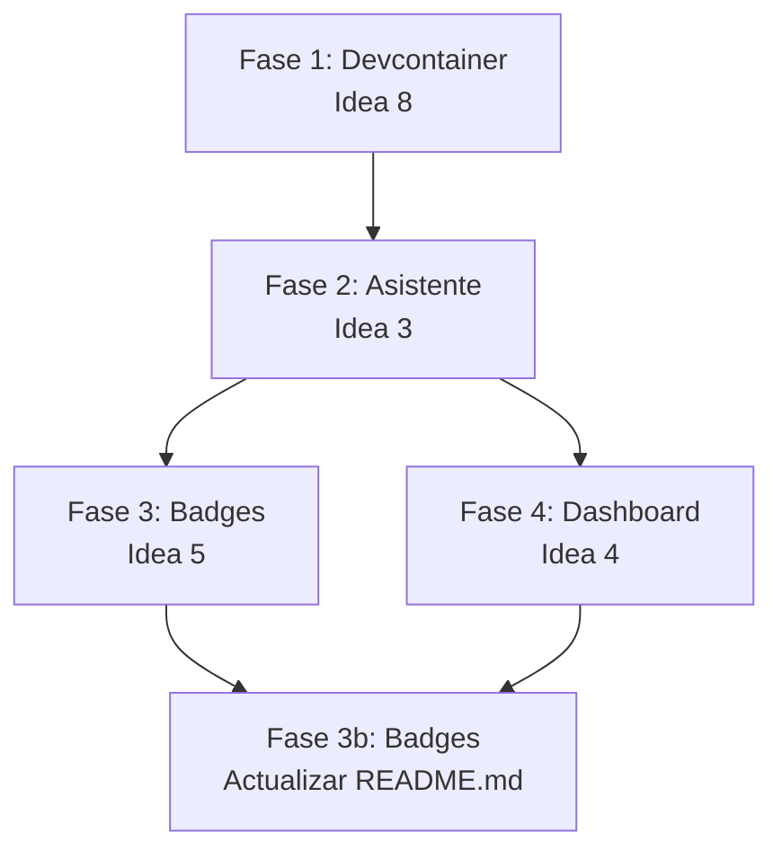

# Plan Arquitectónico: 4 Innovaciones GitHub para Forja

> **Proyecto:** Forja (fa) — Lenguaje de programación educativo en español
> **Versión:** 0.8.8
> **Fecha:** 2026-07-21
> **Autor:** Arquitecto de Forja

---

## Índice

1. [Resumen Ejecutivo](#1-resumen-ejecutivo)
2. [Idea 3: ChatBot / Asistente Forja en GitHub Issues](#2-idea-3-chatbot--asistente-forja-en-github-issues)
3. [Idea 4: Dashboard de Rendimiento Histórico (Benchmarks)](#3-idea-4-dashboard-de-rendimiento-histórico-benchmarks)
4. [Idea 5: Badges Dinámicos en README](#4-idea-5-badges-dinámicos-en-readme)
5. [Idea 8: "Try Forja" Devcontainer / Codespaces](#5-idea-8-try-forja-devcontainer--codespaces)
6. [Plan de Implementación](#6-plan-de-implementación)
7. [Dependencias y Riesgos](#7-dependencias-y-riesgos)

---

## 1. Resumen Ejecutivo

Este plan describe la arquitectura para implementar 4 innovaciones que integran el proyecto Forja con funcionalidades nativas de GitHub:

| # | Idea | Propósito | Archivos nuevos |
|---|------|-----------|-----------------|
| 3 | 🤖 **Asistente Forja en Issues** | Bot que responde automáticamente preguntas sobre sintaxis en Issues | 2 |
| 4 | 📊 **Dashboard de Rendimiento** | Gráficos históricos de evolución de benchmarks | 4 |
| 5 | 🏆 **Badges Dinámicos** | Badges actualizados automáticamente en README | 2 |
| 8 | 🎯 **Try Forja (Codespaces)** | Devcontainer para probar Forja desde el navegador | 3 |

**Total archivos nuevos:** 11  
**Total workflows nuevos:** 4  
**Archivos a modificar:** 1 (`README.md`)

---

## 2. Idea 3: ChatBot / Asistente Forja en GitHub Issues

### 2.1 Diagrama de Flujo



### 2.2 Archivos a Crear

| Archivo | Propósito |
|---------|-----------|
| `.github/workflows/forja-assistant.yml` | Workflow principal del asistente |
| `.github/scripts/assistant.js` | Script Node.js que procesa la lógica de matching |

### 2.3 Estructura Detallada

#### `.github/workflows/forja-assistant.yml`

```yaml
name: Forja Assistant

on:
  issues:
    types: [opened, labeled]

jobs:
  respond:
    # Solo ejecutar si el issue tiene label 'pregunta' o 'question'
    if: |
      (github.event.action == 'opened') ||
      (github.event.action == 'labeled' &&
       (contains(github.event.issue.labels.*.name, 'pregunta') ||
        contains(github.event.issue.labels.*.name, 'question')))
    runs-on: ubuntu-latest
    steps:
      - uses: actions/checkout@v4
        with:
          sparse-checkout: |
            INSTRUCCIONES.md
          sparse-checkout-cone-mode: false
      
      - uses: actions/setup-node@v4
        with:
          node-version: 22
      
      - name: Run assistant
        env:
          GITHUB_TOKEN: ${{ secrets.GITHUB_TOKEN }}
          ISSUE_TITLE: ${{ github.event.issue.title }}
          ISSUE_BODY: ${{ github.event.issue.body }}
          ISSUE_NUMBER: ${{ github.event.issue.number }}
          REPO: ${{ github.repository }}
        run: |
          node .github/scripts/assistant.js
```

#### `.github/scripts/assistant.js`

Archivo JavaScript autónomo que:

1. **Carga `INSTRUCCIONES.md`** y parsea sus secciones basándose en los encabezados `## N. palabra`
2. **Tokeniza el título y cuerpo del issue** en palabras clave (lowercase, elimina stopwords)
3. **Calcula similitud** entre las palabras del issue y los títulos de las secciones de `INSTRUCCIONES.md`
4. **Selecciona las 1-3 secciones** con mayor coincidencia
5. **Construye la respuesta** Markdown con:
   - Saludo personalizado
   - Fragmentos de código relevantes
   - Enlace directo a la sección en `INSTRUCCIONES.md`
   - Enlaces a la documentación oficial y ejemplos
6. **Publica el comentario** usando GitHub API (`POST /repos/{repo}/issues/{issue_number}/comments`)
7. **Agrega label `respondido`** usando GitHub API

**Estructura del script:**

```javascript
// .github/scripts/assistant.js
const fs = require('fs');
const path = require('path');

// 1. Parsear INSTRUCCIONES.md a secciones
//    Formato: ## N. `palabra` / `alias`
//    Extraer: título, ejemplos de código (bloques ```)

// 2. Extraer keywords del issue
//    - Combinar título + body
//    - Normalizar a lowercase
//    - Dividir en palabras y filtrar stopwords

// 3. Hacer matching entre keywords y secciones
//    - Buscar intersección de palabras entre issue y cada sección
//    - Ordenar por número de coincidencias descendente

// 4. Construir respuesta markdown
//    - Template con formato consistente

// 5. Publicar comentario vía GitHub API
//    - fetch() o exec de gh CLI
```

**Diseño de respuesta (template):**

```markdown
👋 ¡Hola @{author}! Gracias por tu pregunta sobre Forja.

Basándome en tu consulta, encontré la siguiente información relevante:

---

## 📖 `{keyword}`

{ejemplo_de_codigo}

> 📚 [Ver documentación completa de `{keyword}`]({link_seccion})

---

💡 **¿Necesitás más ayuda?**
- 📗 [Documentación oficial](https://forja-lang.github.io/docs)
- 📚 [Ejemplos prácticos](https://github.com/forja-lang/forja/tree/main/examples)
- 🔍 Podés usar `forja explicar {keyword}` en la terminal

¡Seguí preguntando si necesitás más detalles! 🚀
```

**Mensaje de fallback (sin coincidencias):**

```markdown
👋 ¡Hola @{author}!

No encontré información específica sobre ese tema en la documentación.

📚 **Recursos útiles:**
- 📗 [Documentación completa de Forja](https://forja-lang.github.io/docs)
- 📚 [Ejemplos prácticos](https://github.com/forja-lang/forja/tree/main/examples)
- 📖 [`INSTRUCCIONES.md`](https://github.com/forja-lang/forja/blob/main/INSTRUCCIONES.md) — palabras clave y sintaxis
- 💻 Probá Forja online con el [Playground WASM](https://forja-lang.github.io/forja/playground)

¿Podés darnos más detalles sobre lo que necesitás? 🚀
```

### 2.4 Dependencias

- **Externa:** `INSTRUCCIONES.md` debe existir (ya existe con 828 líneas y 32 secciones)
- **Externa:** Node.js runtime en el runner (ubuntu-latest ya lo incluye)
- **Interna:** Ninguna — es un workflow autónomo

---

## 3. Idea 4: Dashboard de Rendimiento Histórico (Benchmarks)

### 3.1 Diagrama de Flujo



### 3.2 Archivos a Crear

| Archivo | Propósito |
|---------|-----------|
| `.github/workflows/benchmark-dashboard.yml` | Workflow de benchmarks y deploy |
| `benchmarks/dashboard/index.html` | Dashboard HTML con Chart.js |
| `benchmarks/dashboard/metrics.json` | Datos históricos (generado automáticamente) |
| `.github/scripts/parse-benchmarks.sh` | Script para parsear output de benchmarks |

### 3.3 Estructura Detallada

#### `.github/workflows/benchmark-dashboard.yml`

```yaml
name: Benchmark Dashboard

on:
  push:
    branches: [main, master]
  schedule:
    - cron: '0 6 * * 1'  # Cada lunes 06:00 UTC
  workflow_dispatch:  # Manual trigger

permissions:
  contents: write
  pages: write
  id-token: write

concurrency:
  group: benchmark-pages
  cancel-in-progress: false

jobs:
  benchmark:
    name: Run Benchmarks
    runs-on: ubuntu-latest
    steps:
      - uses: actions/checkout@v4
        with:
          submodules: true
          fetch-depth: 0  # Necesario para git history

      - name: Rust Cache
        uses: swatinem/rust-cache@v2

      - name: Build Forja (release)
        run: cargo build --release

      - name: Run Benchmarks
        id: benchmarks
        run: |
          # Ejecutar cada benchmark y capturar output
          echo "=== BENCH-JIT ===" > benchmark-output.txt
          cargo bench --bench bench-jit -- --nocapture >> benchmark-output.txt 2>&1 || true
          echo "=== BENCH-FORJAFAST ===" >> benchmark-output.txt
          cargo bench --bench bench-forjafast -- --nocapture >> benchmark-output.txt 2>&1 || true
          echo "=== BENCH-VMS ===" >> benchmark-output.txt
          cargo bench --bench bench-vms -- --nocapture >> benchmark-output.txt 2>&1 || true
          cat benchmark-output.txt

      - name: Parse Benchmarks
        id: parse
        run: |
          bash .github/scripts/parse-benchmarks.sh benchmark-output.txt
        env:
          COMMIT_SHA: ${{ github.sha }}
          COMMIT_DATE: ${{ github.event.head_commit.timestamp }}

      - name: Checkout gh-pages (historical data)
        continue-on-error: true
        run: |
          git fetch origin gh-pages --depth=1 || true
          if git rev-parse origin/gh-pages >/dev/null 2>&1; then
            git checkout origin/gh-pages -- benchmarks/dashboard/ 2>/dev/null || true
          fi

      - name: Merge Historical + New Data
        run: |
          mkdir -p benchmarks/dashboard
          # Si existe histórico, merge; si no, crear nuevo
          node -e "
          const fs = require('fs');
          const path = 'benchmarks/dashboard/metrics.json';
          let history = [];
          if (fs.existsSync(path)) {
            history = JSON.parse(fs.readFileSync(path, 'utf8'));
          }
          const newEntry = JSON.parse(process.env.NEW_METRICS);
          history.push(newEntry);
          // Mantener solo últimos 52 entries (1 año de semanal)
          if (history.length > 52) history = history.slice(-52);
          fs.writeFileSync(path, JSON.stringify(history, null, 2));
          "
        env:
          NEW_METRICS: ${{ steps.parse.outputs.metrics }}

      - name: Generate Dashboard HTML
        run: |
          node -e "
          const fs = require('fs');
          const data = JSON.parse(fs.readFileSync('benchmarks/dashboard/metrics.json', 'utf8'));
          // Generar index.html inline con Chart.js
          // Usar template literal con el HTML
          const html = generateDashboard(data);
          fs.writeFileSync('benchmarks/dashboard/index.html', html);
          function generateDashboard(data) {
            // ... template HTML con Chart.js
          }
          "

      - name: Deploy to GitHub Pages
        uses: JamesIves/github-pages-deploy-action@v4
        with:
          folder: benchmarks/dashboard
          target-folder: benchmarks
          branch: gh-pages
```

#### `.github/scripts/parse-benchmarks.sh`

Script bash que parsea el output de `cargo bench` y extrae métricas en formato JSON:

```bash
#!/bin/bash
# parse-benchmarks.sh
# Recibe: archivo con output de benchmarks
# Produce: JSON con métricas estructuradas

OUTPUT_FILE="$1"

# Extraer tiempos de cada benchmark (formato: "time: [X.XXX ms]")
# Usar grep/sed para extraer valores numéricos
# Producir JSON con estructura:
# {
#   "commit_sha": "...",
#   "commit_date": "...",
#   "benchmarks": {
#     "bench-jit": { "mean": 123.4, "stddev": 5.6 },
#     "bench-forjafast": { "mean": 456.7, "stddev": 8.9 },
#     "bench-vms": { "mean": 789.0, "stddev": 1.2 }
#   }
# }

# Template de extracción:
JIT_MEAN=$(grep -A5 "bench-jit" "$OUTPUT_FILE" | grep "time:" | sed -E 's/.*time:.*\[([0-9.]+) ms\].*/\1/')
JIT_STDDEV=$(grep -A5 "bench-jit" "$OUTPUT_FILE" | grep "time:" | sed -E 's/.*time:.*\(\\+?-?([0-9.]+) ms\).*/\1/')

# ... similar para forjafast y vms

# Output JSON
echo "metrics=$(cat <<-END
{
  \"commit_sha\": \"${COMMIT_SHA}\",
  \"date\": \"$(date -u +%Y-%m-%dT%H:%M:%SZ)\",
  \"benchmarks\": {
    \"bench-jit\": { \"mean\": ${JIT_MEAN:-0}, \"stddev\": ${JIT_STDDEV:-0} },
    \"bench-forjafast\": { \"mean\": ${FAST_MEAN:-0}, \"stddev\": ${FAST_STDDEV:-0} },
    \"bench-vms\": { \"mean\": ${VMS_MEAN:-0}, \"stddev\": ${VMS_STDDEV:-0} }
  }
}
END
)" >> $GITHUB_OUTPUT
```

#### `benchmarks/dashboard/index.html`

Página HTML autónoma con Chart.js (cargado desde CDN) que:

1. **Carga `metrics.json`** desde el mismo directorio
2. **Renderiza 3 gráficos de línea** (uno por benchmark: JIT, ForjaFast, VMs)
3. **Muestra tabla resumen** con última medición
4. **Incluye leyenda** con commits y fechas

**Estructura del HTML:**

```html
<!DOCTYPE html>
<html lang="es">
<head>
  <meta charset="UTF-8">
  <meta name="viewport" content="width=device-width, initial-scale=1.0">
  <title>Forja - Dashboard de Rendimiento</title>
  <script src="https://cdn.jsdelivr.net/npm/chart.js@4"></script>
  <style>
    /* Estilos responsivos con tema oscro */
  </style>
</head>
<body>
  <header>
    <h1>📊 Forja - Dashboard de Rendimiento</h1>
    <p>Evolución histórica de benchmarks</p>
  </header>

  <div class="charts-container">
    <div class="chart-card">
      <h2>⚡ JIT (Compilador al Vuelo)</h2>
      <canvas id="chart-jit"></canvas>
    </div>
    <div class="chart-card">
      <h2>🚀 ForjaFast (NaN Tagging)</h2>
      <canvas id="chart-forjafast"></canvas>
    </div>
    <div class="chart-card">
      <h2>🖥️ VM Original</h2>
      <canvas id="chart-vms"></canvas>
    </div>
  </div>

  <section class="summary">
    <h2>📋 Última Medición</h2>
    <table id="summary-table">
      <!-- Poblado por JS -->
    </table>
  </section>

  <script>
    // fetch('metrics.json') → render charts
    // Chart.js line charts con gradient fill
    // Tooltip con commit SHA y fecha
    // Tabla resumen con última entry
  </script>
</body>
</html>
```

### 3.4 Dependencias

- **Interna:** Los benchmarks `bench-jit`, `bench-forjafast`, `bench-vms` deben existir en `Cargo.toml` (ya existen, ver líneas 48-95 de `Cargo.toml`)
- **Externa:** Chart.js CDN (sin dependencia local)
- **Externa:** Acción `JamesIves/github-pages-deploy-action@v4`
- **Deploy:** El dashboard se publica bajo `https://forja-lang.github.io/forja/benchmarks/`

---

## 4. Idea 5: Badges Dinámicos en README

### 4.1 Diagrama de Flujo



### 4.2 Archivos a Crear/Modificar

| Archivo | Propósito | Acción |
|---------|-----------|--------|
| `.github/workflows/metrics.yml` | Generar y desplegar metrics.json | Crear |
| `.github/scripts/metrics.sh` | Script para calcular métricas | Crear |
| `README.md` | Agregar badges dinámicos | Modificar |

### 4.3 Estructura Detallada

#### `.github/workflows/metrics.yml`

```yaml
name: Metrics

on:
  push:
    branches: [main, master]

permissions:
  contents: write

jobs:
  metrics:
    name: Generate Metrics
    runs-on: ubuntu-latest
    steps:
      - uses: actions/checkout@v4
        with:
          submodules: true
          fetch-depth: 0
      
      - name: Rust Cache
        uses: swatinem/rust-cache@v2

      - name: Run tests
        run: |
          cargo test --verbose 2>&1 | tee test-output.txt || true
      
      - name: Generate metrics.json
        id: gen-metrics
        run: |
          bash .github/scripts/metrics.sh
        env:
          CARGO_VERSION: ${{ github.ref_name }}
      
      - name: Checkout gh-pages
        continue-on-error: true
        run: |
          git fetch origin gh-pages --depth=1 || true
          git worktree add gh-pages-out gh-pages 2>/dev/null || git worktree add gh-pages-out origin/gh-pages 2>/dev/null || mkdir -p gh-pages-out
      
      - name: Copy metrics.json
        run: |
          mkdir -p gh-pages-out
          cp metrics.json gh-pages-out/
      
      - name: Deploy to GitHub Pages
        uses: JamesIves/github-pages-deploy-action@v4
        with:
          folder: gh-pages-out
          target-folder: .
          branch: gh-pages
          clean: false  # No limpiar otros archivos
```

#### `.github/scripts/metrics.sh`

```bash
#!/bin/bash
# metrics.sh — Genera metrics.json con métricas del proyecto

set -e

# 1. Versión desde Cargo.toml
VERSION=$(grep '^version' Cargo.toml | head -1 | cut -d'"' -f2)

# 2. Tests pasando
TEST_PASS=$(grep -c "^test .* \.\.\. ok$" test-output.txt 2>/dev/null || echo "0")
TEST_FAIL=$(grep -c "^test .* \.\.\. FAILED$" test-output.txt 2>/dev/null || echo "0")

# 3. Fecha del último commit
LAST_COMMIT=$(git log -1 --format=%cd --date=iso-strict 2>/dev/null || echo "")

# 4. Líneas de código Rust
RUST_LINES=$(find src crates -name "*.rs" -exec cat {} + 2>/dev/null | wc -l)

# 5. Rendimiento JIT (del último benchmark si existe)
# Intentar obtener desde gh-pages
JIT_PERF=$(git show origin/gh-pages:benchmarks/metrics.json 2>/dev/null | \
  python3 -c "import sys,json; d=json.load(sys.stdin); print(d[-1].get('benchmarks',{}).get('bench-jit',{}).get('mean',0))" 2>/dev/null || echo "0")

# Generar JSON
cat > metrics.json << EOF
{
  "version": "${VERSION}",
  "tests_passing": ${TEST_PASS},
  "tests_failing": ${TEST_FAIL},
  "last_commit": "${LAST_COMMIT}",
  "rust_lines": ${RUST_LINES},
  "jit_performance_ms": ${JIT_PERF}
}
EOF

cat metrics.json
```

#### Modificación en `README.md`

Se agregan los badges al inicio del `README.md`, después del título y antes de la sección de arquitectura:

```markdown
# 🔥 Forja (fa)

[](https://github.com/forja-lang/forja/releases)
[](https://github.com/forja-lang/forja/actions)
[&color=orange&style=for-the-badge)](https://forja-lang.github.io/forja/benchmarks/)
[](src/)
```

**Nota de diseño:** Los badges se colocan estratégicamente:
- Antes de la sección "Arquitectura del Compilador e Intérprete"
- Usando `style=for-the-badge` para consistencia visual
- Cada badge tiene un color distintivo según la métrica

### 4.4 Dependencias

- **Deploy:** El `metrics.json` debe estar disponible en la misma raíz de GitHub Pages que el dashboard de benchmarks
- **Precedencia:** Debe ejecutarse después o junto al workflow de benchmarks para incluir `jit_performance_ms`
- **Externa:** shields.io API (disponible públicamente)

---

## 5. Idea 8: "Try Forja" Devcontainer / Codespaces

### 5.1 Diagrama de Flujo



### 5.2 Archivos a Crear

| Archivo | Propósito |
|---------|-----------|
| `.devcontainer/devcontainer.json` | Configuración principal del devcontainer |
| `.devcontainer/post-create.sh` | Script post-creación con mensaje de bienvenida |
| `.devcontainer/Dockerfile` | (Opcional) Solo si se necesita personalizar la imagen |

### 5.3 Estructura Detallada

#### `.devcontainer/devcontainer.json`

```json
{
  "name": "Forja - Try It!",
  "image": "mcr.microsoft.com/devcontainers/universal:2",
  
  "onCreateCommand": "cargo build --release",
  
  "postCreateCommand": "bash .devcontainer/post-create.sh",
  
  "forwardPorts": [8000],
  
  "portsAttributes": {
    "8000": {
      "label": "Forja Playground",
      "onAutoForward": "openBrowser"
    }
  },
  
  "customizations": {
    "vscode": {
      "extensions": [
        "forja-lang.forja-syntax"
      ],
      "settings": {
        "editor.formatOnSave": true,
        "files.associations": {
          "*.fa": "forja"
        }
      }
    }
  },
  
  "postStartCommand": "cargo build --release 2>/dev/null; echo '✅ Forja listo para usar'"
}
```

**Puntos clave de la configuración:**

| Campo | Valor | Razón |
|-------|-------|-------|
| `image` | `mcr.microsoft.com/devcontainers/universal:2` | Ya incluye Rust, Node.js, Python. No requiere Dockerfile adicional |
| `onCreateCommand` | `cargo build --release` | Compila Forja una vez al crear el codespace (toma ~2-3 min) |
| `postCreateCommand` | script bash | Mensaje de bienvenida con instrucciones |
| `forwardPorts` | `[8000]` | Para el playground WASM de la documentación |
| `extensions` | `forja-lang.forja-syntax` | Extensión de VS Code publicada en el marketplace |

#### `.devcontainer/post-create.sh`

```bash
#!/bin/bash
# post-create.sh — Mensaje de bienvenida al crear el Codespace

echo ""
echo "╔══════════════════════════════════════════════════════════════╗"
echo "║            🔥  Forja - Try It!  🔥                          ║"
echo "║  Lenguaje de programación educativo en español              ║"
echo "╠══════════════════════════════════════════════════════════════╣"
echo "║                                                            ║"
echo "║  📝 Para empezar:                                          ║"
echo "║                                                            ║"
echo "║   forja ejecutar examples/01_hola.fa                       ║"
echo "║   forja interactivo                                        ║"
echo "║   forja diagrama examples/01_hola.fa                       ║"
echo "║                                                            ║"
echo "║  📚 Documentación:                                         ║"
echo "║   forja aprender                                           ║"
echo "║   forja explicar variable                                  ║"
echo "║   code .devcontainer/INSTRUCCIONES.md                      ║"
echo "║                                                            ║"
echo "║  🌐 Playground Web:                                        ║"
echo "║   cd docs && npm install && npm run dev                    ║"
echo "║   (abrir http://localhost:8000/playground)                 ║"
echo "║                                                            ║"
echo "║  ✅ Forja v$(grep '^version' Cargo.toml | head -1 | cut -d'\"' -f2) compilado!           ║"
echo "║                                                            ║"
echo "╚══════════════════════════════════════════════════════════════╝"
echo ""
```

#### `.devcontainer/Dockerfile` (Opcional — solo si se necesita)

En caso de que se requiera personalización adicional (por ejemplo, pre-instalar herramientas WASM):

```dockerfile
FROM mcr.microsoft.com/devcontainers/universal:2

# Instalar herramientas WASM
RUN cargo install wasm-bindgen-cli wasm-pack
RUN sudo apt-get update && sudo apt-get install -y binaryen

# Pre-descargar dependencias Rust (layer caching)
WORKDIR /tmp
COPY Cargo.toml Cargo.lock ./
RUN mkdir src && echo "fn main() {}" > src/main.rs
RUN cargo fetch
RUN rm -rf /tmp/*
```

**Decisión:** NO incluir Dockerfile inicial. La imagen `universal:2` ya trae Rust 1.85+, Node.js 24, Python 3.12 — suficiente para probar Forja. Si en el futuro se necesitan herramientas WASM pre-instaladas, se puede agregar.

### 5.4 Dependencias

- **Externa:** Visual Studio Code Extension `forja-lang.forja-syntax` debe estar publicada en el marketplace
- **Externa:** Imagen `mcr.microsoft.com/devcontainers/universal:2` (disponible públicamente)
- **Interna:** `cargo build --release` debe compilar exitosamente (depende de `Cargo.toml` y `src/`)

---

## 6. Plan de Implementación

### 6.1 Orden de Implementación Sugerido



**Lógica del orden:**
1. **Devcontainer (Idea 8)** primero porque es el más simple y autónomo — no depende de nada
2. **Asistente (Idea 3)** segundo porque solo depende de `INSTRUCCIONES.md` que ya existe
3. **Badges (Idea 5)** tercero porque el workflow de metrics puede funcionar independientemente
4. **Dashboard (Idea 4)** al final porque es el más complejo y requiere ajustar benchmarks

### 6.2 Lista de Tareas Detallada

#### Fase 1: Devcontainer / Codespaces (Idea 8)

| # | Tarea | Archivo | Esfuerzo | Depende de |
|---|-------|---------|----------|------------|
| 1.1 | Crear `.devcontainer/devcontainer.json` con imagen universal, forwardPorts, extensiones | `.devcontainer/devcontainer.json` | Pequeño | Ninguna |
| 1.2 | Crear script de bienvenida post-create | `.devcontainer/post-create.sh` | Pequeño | 1.1 |
| 1.3 | (Opcional) Verificar que la extensión VS Code está publicada | — | Validación | Documentación |

#### Fase 2: Asistente Forja en Issues (Idea 3)

| # | Tarea | Archivo | Esfuerzo | Depende de |
|---|-------|---------|----------|------------|
| 2.1 | Crear workflow YAML con trigger issues.opened + issues.labeled | `.github/workflows/forja-assistant.yml` | Pequeño | Ninguna |
| 2.2 | Implementar script Node.js de parsing y matching | `.github/scripts/assistant.js` | Medio | 2.1 |
| 2.3 | Crear labels "pregunta" y "question" en el repo | — | Mínimo | Documentación |

#### Fase 3: Badges Dinámicos (Idea 5)

| # | Tarea | Archivo | Esfuerzo | Depende de |
|---|-------|---------|----------|------------|
| 3.1 | Crear script para generar metrics.json | `.github/scripts/metrics.sh` | Medio | Ninguna |
| 3.2 | Crear workflow que corre en push a main | `.github/workflows/metrics.yml` | Pequeño | 3.1 |
| 3.3 | Modificar README.md con shields.io badges | `README.md` | Pequeño | 3.2 |

#### Fase 4: Dashboard de Rendimiento (Idea 4)

| # | Tarea | Archivo | Esfuerzo | Depende de |
|---|-------|---------|----------|------------|
| 4.1 | Crear script para parsear output de benchmarks | `.github/scripts/parse-benchmarks.sh` | Medio | Ninguna |
| 4.2 | Crear dashboard HTML con Chart.js | `benchmarks/dashboard/index.html` | Alto | 4.1 |
| 4.3 | Crear workflow con triggers (push + schedule) y deploy | `.github/workflows/benchmark-dashboard.yml` | Alto | 4.1, 4.2 |
| 4.4 | Verificar que los benchmarks existen en Cargo.toml | — | Validación | Documentación |

### 6.3 Resumen de Esfuerzo por Fase

| Fase | Tareas | Esfuerzo Total |
|------|--------|----------------|
| 1. Devcontainer | 2-3 tareas | **Pequeño** (~30 min) |
| 2. Asistente Issues | 3 tareas | **Medio** (~2 h) |
| 3. Badges Dinámicos | 3 tareas | **Medio** (~1.5 h) |
| 4. Dashboard Benchmarks | 4 tareas | **Alto** (~4 h) |
| **Total** | **12-13 tareas** | **~8 h** |

---

## 7. Dependencias y Riesgos

### 7.1 Matriz de Dependencias

```
Idea 8 (Devcontainer) ─── autónomo
Idea 3 (Assistant)    ─── autónomo (solo depende de INSTRUCCIONES.md ✓)
Idea 5 (Badges)       ─── depende de: gh-pages branch existente
Idea 4 (Dashboard)    ─── depende de: benchmarks funcionando, gh-pages branch
```

### 7.2 Riesgos Identificados

| Riesgo | Impacto | Probabilidad | Mitigación |
|--------|---------|-------------|------------|
| La extensión VS Code no está publicada en marketplace | ⚠️ Medio | Baja | Usar `.vsix` local desde el submódulo `vscode/` en `devcontainer.json` con `"vsix": "vscode/forja-syntax/forja-syntax-0.8.8.vsix"` |
| Los benchmarks no producen output parseable | 🔴 Alto | Baja | Hacer prueba manual primero; el script de parsing debe ser tolerante a errores |
| GitHub Pages no está configurado en el repo | 🔴 Alto | Baja | Agregar tarea de configuración inicial en el plan (Settings > Pages > branch: gh-pages) |
| `cargo build --release` tarda >10 min en Codespaces | ⚠️ Medio | Media | Usar `cargo build` (debug) en `onCreateCommand`, es más rápido; release puede hacerse en background |
| El script Node.js del asistente no encuentra keywords | ⚠️ Medio | Baja | Implementar matching fuzzy (includes, levenshtein) y buen fallback |

### 7.3 Configuración Inicial Requerida en GitHub

Antes de implementar, el repositorio debe tener:

1. ✅ **GitHub Pages habilitado** en `Settings > Pages > Source: Deploy from branch > branch: gh-pages`
2. ❌ **Labels creados:** `pregunta` y `question` (para el asistente de Issues)
3. ⚠️ **Extensión VS Code publicada** (o alternativa con `.vsix` local)
4. ⚠️ **gh-pages branch existente** (o se crea en el primer deploy)

---

## Apéndice A: Estructura de Archivos Resultante

```
forja/
├── .devcontainer/
│   ├── devcontainer.json        ← NUEVO: Config Codespaces
│   └── post-create.sh           ← NUEVO: Bienvenida
│
├── .github/
│   ├── workflows/
│   │   ├── rust.yml             ← EXISTENTE
│   │   ├── docs-deploy.yml      ← EXISTENTE
│   │   ├── forja-assistant.yml  ← NUEVO: Asistente Issues
│   │   ├── benchmark-dashboard.yml ← NUEVO: Dashboard
│   │   └── metrics.yml          ← NUEVO: Badges
│   └── scripts/
│       ├── assistant.js         ← NUEVO: Lógica del asistente
│       ├── parse-benchmarks.sh  ← NUEVO: Parser de benchmarks
│       └── metrics.sh           ← NUEVO: Generador de métricas
│
├── benchmarks/
│   └── dashboard/
│       ├── index.html           ← NUEVO: Dashboard Chart.js
│       └── metrics.json         ← NUEVO: Datos históricos (generado)
│
├── README.md                    ← MODIFICADO: Badges dinámicos
│
└── ... resto del proyecto
```

## Apéndice B: Referencias Técnicas

| Recurso | URL |
|---------|-----|
| Chart.js Docs | https://www.chartjs.org/docs |
| shields.io Dynamic JSON | https://shields.io/badges/dynamic-json-badge |
| GitHub Pages Deploy Action | https://github.com/JamesIves/github-pages-deploy-action |
| Devcontainers Specification | https://containers.dev/ |
| GitHub Issues API | https://docs.github.com/en/rest/issues/comments |
| Forja Documentation | https://forja-lang.github.io/docs |
